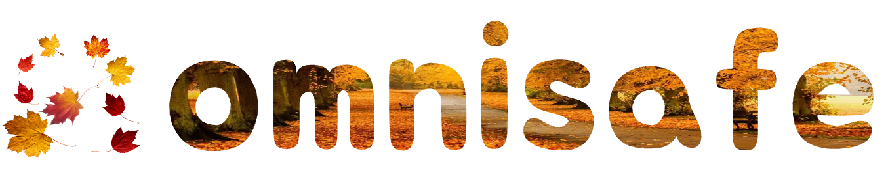

<!-- markdownlint-disable first-line-h1 -->
<!-- markdownlint-disable html -->

<div align="center">
  
</div>

[](https://github.com/PKU-MARL)
[](https://pypi.org/project/omnisafe)
[](https://omnisafe.readthedocs.io)
[](https://pepy.tech/project/omnisafe)
[](https://github.com/PKU-MARL/OmniSafe/stargazers)
[](#license)

# OmniSafe

OmniSafe is a comprehensive and reliable benchmark for safe reinforcement learning, covering a multitude of SafeRL domains and delivering a new suite of testing environments.

The simulation environment around OmniSafe and a series of reliable algorithm implementations will help the SafeRL research community easier to replicate and improve the excellent work already done while also helping to facilitate the validation of new ideas and new algorithms.

--------------------------------------------------------------------------------

### Table of Contents  <!-- omit in toc --> <!-- markdownlint-disable heading-increment -->

- [OmniSafe](#omnisafe)
    - [Table of Contents   ](#table-of-contents---)
  - [Overview](#overview)
  - [Implemented Algorithms](#implemented-algorithms)
    - [Newly Published in 2022](#newly-published-in-2022)
    - [List of Algorithms](#list-of-algorithms)
      - [On-Policy Safe](#on-policy-safe)
      - [Off-Policy Safe](#off-policy-safe)
      - [Model-Based Safe](#model-based-safe)
      - [Offline Safe](#offline-safe)
      - [Others](#others)
  - [SafeRL Environments](#saferl-environments)
    - [Safety Gymnasium](#safety-gymnasium)
    - [Vision-base Safe RL](#vision-base-safe-rl)
    - [Environment Usage](#environment-usage)
  - [Installation](#installation)
    - [Prerequisites](#prerequisites)
    - [Install from source](#install-from-source)
    - [Examples](#examples)
  - [Getting Started](#getting-started)
    - [1. Run Agent from preset yaml file](#1-run-agent-from-preset-yaml-file)
    - [2. Run Agent from custom config dict](#2-run-agent-from-custom-config-dict)
    - [3. Run Agent from custom terminal config](#3-run-agent-from-custom-terminal-config)
  - [The OmniSafe Team](#the-omnisafe-team)
  - [License](#license)

--------------------------------------------------------------------------------

## Overview

Here we provide a table for comparison of **OmniSafe's algorithm core** and existing algorithm baseline.

|                                                                                 SafeRL<br/>Platform                                                                                 | Backend |            Engine             | # Safe Algo.        | Parallel<br/> CPU/GPU | New Gym API<sup>**(4)**</sup> |    Vision Input     |
| :---------------------------------------------------------------------------------------------------------------------------------------------------------------------------------: | :-----: | :---------------------------: | ------------------- | :-------------------: | :---------------------------: | :-----------------: |
|            [Safety-Gym](https://github.com/openai/safety-gym)<br/>            |   TF1   | `mujoco-py`<sup>**(1)**</sup> | 3                   |  CPU Only (`mpi4py`)  |               ❌               | minimally supported |
| [safe-control-gym](https://github.com/utiasDSL/safe-control-gym)<br/> | PyTorch |           PyBullet            | 5<sup>**(2)**</sup> |                       |               ❌               |          ❌          |
|                                                                       Velocity-Constraints<sup>**(3)**</sup>                                                                        |   N/A   |              N/A              | N/A                 |          N/A          |               ❌               |          ❌          |
|    [mujoco-circle](https://github.com/ymzhang01/mujoco-circle)<br/>     | PyTorch |              N/A              | 0                   |          N/A          |               ❌               |          ❌          |
|                                 OmniSafe<br/>                                 | PyTorch |       **MuJoCo 2.3.0+**       | **25+**             |  `torch.distributed`  |               ✅               |          ✅          |

<sup>(1): Maintenance (expect bug fixes and minor updates), the last commit is 19 Nov 2021. Safety Gym depends on `mujoco-py` 2.0.2.7, which was updated on Oct 12, 2019.</sup><br/>
<sup>(2): We only count the safe's algorithm.</sup><br/>
<sup>(3): There is no official library for speed-related libraries, and its associated cost constraints are constructed from info. But the task is widely used in the study of SafeRL, and we encapsulate it in OmniSafe.</sup><br/>
<sup>(4): In the gym 0.26.0 release update, a new API of interaction was redefined.</sup>

--------------------------------------------------------------------------------

## Implemented Algorithms

The supported interface algorithms currently include:

### Newly Published in 2022

- [X] **[AAAI 2023]** Augmented Proximal Policy Optimization for Safe Reinforcement Learning (APPO) **The original author of the paper contributed code**
- [X] **[NeurIPS 2022]** [Constrained Update Projection Approach to Safe Policy Optimization (CUP)](https://arxiv.org/abs/2209.07089) **The original author of the paper contributed code**
- [ ] **[NeurIPS 2022]** (Under Testing) [Effects of Safety State Augmentation on
Safe Exploration (Swimmer)](https://arxiv.org/abs/2206.02675)
- [X] **[NeurIPS 2022]** [Model-based Safe Deep Reinforcement Learning via a Constrained Proximal Policy Optimization Algorithm](https://arxiv.org/abs/2210.07573)
- [ ] **[ICML 2022]** (Under Testing) [Sauté RL: Almost Surely Safe Reinforcement Learning Using State Augmentation (SauteRL)](https://arxiv.org/abs/2202.06558)
- [ ] **[ICML 2022]** (Under Testing) [Constrained Variational Policy Optimization for Safe Reinforcement Learning (CVPO)](https://arxiv.org/abs/2201.11927)
- [X] **[IJCAI 2022]** [Penalized Proximal Policy Optimization for Safe Reinforcement Learning](https://arxiv.org/abs/2205.11814) **The original author of the paper contributed code**
- [ ] **[ICLR 2022]** [Constrained Policy Optimization via Bayesian World Models (LAMBDA)](https://arxiv.org/abs/2201.09802)
- [ ] **[AAAI 2022]** [Conservative and Adaptive Penalty for Model-Based Safe Reinforcement Learning (CAP)](https://arxiv.org/abs/2112.07701)

### List of Algorithms

#### On-Policy Safe

- [X] [The Lagrange version of PPO (PPO-Lag)](https://cdn.openai.com/safexp-short.pdf)
- [X] [The Lagrange version of TRPO (TRPO-Lag)](https://cdn.openai.com/safexp-short.pdf)
- [X] **[ICML 2017]** [Constrained Policy Optimization (CPO)](https://proceedings.mlr.press/v70/achiam17a)
- [X] **[ICLR 2019]** [Reward Constrained Policy Optimization (RCPO)](https://openreview.net/forum?id=SkfrvsA9FX)
- [X] **[ICML 2020]** [Responsive Safety in Reinforcement Learning by PID Lagrangian Methods (PID-Lag)](https://arxiv.org/abs/2007.03964)
- [X] **[NeurIPS 2020]** [First Order Constrained Optimization in Policy Space (FOCOPS)](https://arxiv.org/abs/2002.06506)
- [X] **[AAAI 2020]** [IPO: Interior-point Policy Optimization under Constraints (IPO)](https://arxiv.org/abs/1910.09615)
- [X] **[ICLR 2020]** [Projection-Based Constrained Policy Optimization (PCPO)](https://openreview.net/forum?id=rke3TJrtPS)
- [X] **[ICML 2021]** [CRPO: A New Approach for Safe Reinforcement Learning with Convergence Guarantee](https://arxiv.org/abs/2011.05869)

#### Off-Policy Safe

- [X] The Lagrange version of TD3 (TD3-Lag)
- [X] The Lagrange version of DDPG (DDPG-Lag)
- [X] The Lagrange version of SAC (SAC-Lag)
- [X] **[ICML 2019]** [Lyapunov-based Safe Policy Optimization for Continuous Control (SDDPG)](https://arxiv.org/abs/1901.10031)
- [X] **[ICML 2019]** [Lyapunov-based Safe Policy Optimization for Continuous Control (SDDPG-modular)](https://arxiv.org/abs/1901.10031)
- [ ] **[ICML 2022]** [Constrained Variational Policy Optimization for Safe Reinforcement Learning (CVPO)](https://arxiv.org/abs/2201.11927)

#### Model-Based Safe

- [ ] **[NeurIPS 2021]** [Safe Reinforcement Learning by Imagining the Near Future (SMBPO)](https://arxiv.org/abs/2202.07789)
- [X] **[CoRL 2021 (Oral)]** [Learning Off-Policy with Online Planning (SafeLoop)](https://arxiv.org/abs/2008.10066)
- [X] **[AAAI 2022]** [Conservative and Adaptive Penalty for Model-Based Safe Reinforcement Learning (CAP)](https://arxiv.org/abs/2112.07701)
- [ ] **[NeurIPS 2022]** [Model-based Safe Deep Reinforcement Learning via a Constrained Proximal Policy Optimization Algorithm](https://arxiv.org/abs/2210.07573)
- [ ] **[ICLR 2022]** [Constrained Policy Optimization via Bayesian World Models (LAMBDA)](https://arxiv.org/abs/2201.09802)

#### Offline Safe

- [X] [The Lagrange version of BCQ (BCQ-Lag)](https://arxiv.org/abs/1812.02900)
- [X] [The Constrained version of CRR (C-CRR)](https://proceedings.neurips.cc/paper/2020/hash/588cb956d6bbe67078f29f8de420a13d-Abstract.html)
- [ ] **[AAAI 2022]** [Constraints Penalized Q-learning for Safe Offline Reinforcement Learning CPQ](https://arxiv.org/abs/2107.09003)
- [ ] **[ICLR 2022 (Spotlight)]** [COptiDICE: Offline Constrained Reinforcement Learning via Stationary Distribution Correction Estimation](https://arxiv.org/abs/2204.08957?context=cs.AI)
- [ ] **[ICML 2022]** [Constrained Offline Policy Optimization (COPO)](https://proceedings.mlr.press/v162/polosky22a.html)

#### Others

- [X] [Safe Exploration in Continuous Action Spaces (Safety Layer)](https://arxiv.org/abs/1801.08757)
- [ ] **[RA-L 2021]** [Recovery RL: Safe Reinforcement Learning with Learned Recovery Zones](https://arxiv.org/abs/2010.15920)
- [ ] **[ICML 2022]** [Sauté RL: Almost Surely Safe Reinforcement Learning Using State Augmentation (SauteRL)](https://arxiv.org/abs/2202.06558)
- [ ] **[NeurIPS 2022]** [Effects of Safety State Augmentation on Safe Exploration](https://arxiv.org/abs/2206.02675)

--------------------------------------------------------------------------------

## SafeRL Environments

### Safety Gymnasium

We designed a variety of safety-enhanced learning tasks around the latest version of Gymnasium, including safety-run, safety-circle, safety-goal, safety-button, etc., leading to a unified safety-enhanced learning benchmark environment called `safety-gymnasium`.

Further, to facilitate the progress of community research, we redesigned [Safety-Gym](https://github.com/openai/safety-gym) and removed the dependency on `mujoco-py`. We build it on top of [MuJoCo](https://github.com/deepmind/mujoco), and fixed some bugs.

After careful testing, we confirmed that it has the same dynamics parameters and training environment as the original `safety-gym`, named `safety-gymnasium`.

Here is a list of all the environments we support, some of them are being tested in our baseline and we will gradually release them within a month.

<table>
  <tbody>
    <tr align="center" valign="bottom">
      <td>
        <b>Tasks</b>
      </td>
      <td>
        <b>Diffcults</b>
      </td>
      <td>
        <b>Agents</b>
      </td>
    </tr>
    <tr valign="top">
      <td>
        <ul>
            <li><b>Safety Velocity</b></li>
            <li><b>Safety Run</b></li>
            <li><b>Safety Circle</b></li>
            <li><b>Safety Goal</b></li>
            <li><b>Safety Button</b></li>
            <li><b>Safety Push</b></li>
            <li><b>Safety Race</b></li>
            <li><b>Safety Narrow</b></li>
      </ul>
      </td>
      <td>
        <ul>
          <li>Level-0</li>
          <li>Level-1</li>
          <li>Level-2</li>
        </ul>
      </td>
      <td>
        </ul>
          <li>Ant-v4</b></li>
          <li>Humanoid-v4</li>
          <li>Hopper-v4</li>
          <li>Point</li>
          <li>Car</li>
        <ul>
      </td>
    </tr>
  </tbody>
</table>

### Vision-base Safe RL

Vision-based safety reinforcement learning lacks realistic scenarios. Although the original `safety-gym` could minimally support visual input, the scenarios were too homogeneous. To facilitate the validation of visual-based safety reinforcement learning algorithms, we have developed a set of realistic vision-based safeRL tasks, which are currently being validated on the baseline, and we will release that part of the environment in `safety-gymnasium` within a month.

For the appetizer, the images are as follows
<div align="center">
  
</div>


### Environment Usage

**Notes:** We support new [**Gymnasium APIs**](https://github.com/Farama-Foundation/Gymnasium).

```python
import safety_gymnasium

env_name = 'SafetyPointGoal1-v0'
env = safety_gymnasium.make(env_name)

obs, info = env.reset()
terminated = False

while not terminated:
    act = env.action_space.sample()
    obs, reward, cost, terminated, truncated, info = env.step(act)
    env.render()
```

--------------------------------------------------------------------------------

## Installation

### Prerequisites

OmniSafe requires Python 3.8+ and PyTorch 1.10+.

### Install from source

```bash
git clone https://github.com/PKU-MARL/omnisafe
cd omnisafe
conda create -n omnisafe python=3.8
conda activate omnisafe
# Please refer to https://pytorch.org/get-started/previous-versions and install pytorch

# Install safety-gymnasium
pip install -e envs/safety-gymnasium
# Install omnisafe
pip install -e .
```

### Examples

```bash
cd examples
python train_policy.py --env-id SafetyPointGoal1-v0 --algo PPOLag --parallel 1 --seed 0
```

**algo:** `PolicyGradient, PPO, PPOLag, NaturalPG, TRPO, TRPOLag, PDO, NPGLag, CPO, PCPO, FOCOPS, CPPOPid`

**env-id:** `Safety{Robot-id}{Task-id}{0/1/2}-v0, (Robot-id: Point Car), (Task-id: Goal Push Button)`

**parallel:** `Number of parallels`

--------------------------------------------------------------------------------

## Getting Started

### 1. Run Agent from preset yaml file

```python
import omnisafe

env = omnisafe.Env('SafetyPointGoal1-v0')

agent = omnisafe.Agent('PPOLag', env)
agent.learn()

# obs = env.reset()
# for i in range(1000):
#     action, _states = agent.predict(obs, deterministic=True)
#     obs, reward, cost, done, info = env.step(action)
#     env.render()
#     if done:
#         obs = env.reset()
# env.close()
```

### 2. Run Agent from custom config dict

```python
import omnisafe

env = omnisafe.Env('SafetyPointGoal1-v0')

custom_dict = {'epochs': 1, 'data_dir': './runs'}
agent = omnisafe.Agent('PPOLag', env, custom_cfgs=custom_dict)
agent.learn()

# obs = env.reset()
# for i in range(1000):
#     action, _states = agent.predict(obs, deterministic=True)
#     obs, reward, done, info = env.step(action)
#     env.render()
#     if done:
#         obs = env.reset()
# env.close()
```

### 3. Run Agent from custom terminal config

```bash
cd examples
python train_on_policy.py --env-id SafetyPointGoal1-v0 --algo PPOLag --parallel 5 --epochs 1
```

--------------------------------------------------------------------------------

## The OmniSafe Team

OmniSafe is currently maintained by Borong Zhang, [Jiayi Zhou](https://github.com/Gaiejj), [JTao Dai](https://github.com/calico-1226), [Weidong Huang](https://github.com/hdadong), [Ruiyang Sun](https://github.com/rockmagma02) ,[Xuehai Pan](https://github.com/XuehaiPan), [Jiamg Ji](https://github.com/zmsn-2077) and under the instruction of Prof. [Yaodong Yang](https://github.com/orgs/PKU-MARL/people/PKU-YYang). If you have any question in the process of using omnisafe, don't hesitate to ask your question in [the GitHub issue page](https://github.com/PKU-MARL/omnisafe/issues/new/choose), we will reply you in 2-3 working days.

## License

OmniSafe is released under Apache License 2.0.
