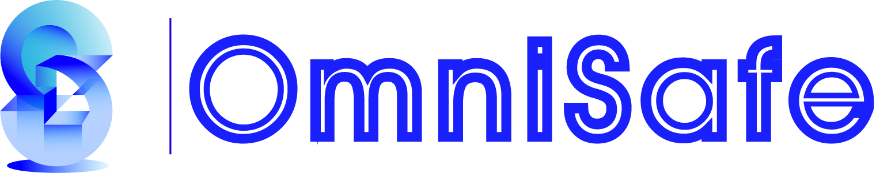

<!-- markdownlint-disable first-line-h1 -->
<!-- markdownlint-disable html -->

<div align="center">
  
</div>

[](https://github.com/PKU-MARL)
[](https://pypi.org/project/omnisafe)
[](https://omnisafe.readthedocs.io)
[](https://pepy.tech/project/omnisafe)
[](https://github.com/PKU-MARL/OmniSafe/stargazers)
[](https://github.com/psf/black)
[](#license)

<p align="center">
  <a href="https://omnisafe.readthedocs.io">Documentation</a> |
  <a href="https://github.com/PKU-MARL/omnisafe#implemented-algorithms">Implemented Algorithms</a> |
  <a href="https://github.com/PKU-MARL/omnisafe#installation">Installation</a> |
  <a href="https://github.com/PKU-MARL/omnisafe#getting-started">Getting Started</a> |
  <a href="https://github.com/PKU-MARL/omnisafe#license">License</a>
</p>

# OmniSafe

OmniSafe is a comprehensive and reliable benchmark for safe reinforcement learning, covering a multitude of SafeRL domains and delivering a new suite of testing environments.

The simulation environment around OmniSafe and a series of reliable algorithm implementations will help the SafeRL research community easier to replicate and improve the excellent work already done while also helping to facilitate the validation of new ideas and new algorithms.

--------------------------------------------------------------------------------

### Table of Contents  <!-- omit in toc --> <!-- markdownlint-disable heading-increment -->

- [Implemented Algorithms](#implemented-algorithms)
  - [Newly Published in 2022](#newly-published-in-2022)
  - [List of Algorithms](#list-of-algorithms)
    - [On-Policy Safe](#on-policy-safe)
    - [Off-Policy Safe](#off-policy-safe)
    - [Model-Based Safe](#model-based-safe)
    - [Offline Safe](#offline-safe)
    - [Others](#others)
- [Installation](#installation)
  - [Prerequisites](#prerequisites)
  - [Install from source](#install-from-source)
  - [Examples](#examples)
- [Getting Started](#getting-started)
  - [1. Run Agent from preset yaml file](#1-run-agent-from-preset-yaml-file)
  - [2. Run Agent from custom config dict](#2-run-agent-from-custom-config-dict)
  - [3. Run Agent from custom terminal config](#3-run-agent-from-custom-terminal-config)
  - [4. Evalutate Saved Policy](#4-evalutate-saved-policy)
- [The OmniSafe Team](#the-omnisafe-team)
- [License](#license)

--------------------------------------------------------------------------------

## Implemented Algorithms

The supported interface algorithms currently include:

### Newly Published in 2022

- [X] **[AAAI 2023]** Augmented Proximal Policy Optimization for Safe Reinforcement Learning (APPO) **The original author of the paper contributed code**
- [X] **[NeurIPS 2022]** [Constrained Update Projection Approach to Safe Policy Optimization (CUP)](https://arxiv.org/abs/2209.07089) **The original author of the paper contributed code**
- [X] **[NeurIPS 2022]** [Effects of Safety State Augmentation on Safe Exploration (Simmer)](https://arxiv.org/abs/2206.02675)
- [X] **[NeurIPS 2022]** [Model-based Safe Deep Reinforcement Learning via a Constrained Proximal Policy Optimization Algorithm](https://arxiv.org/abs/2210.07573)
- [X] **[ICML 2022]** [Sauté RL: Almost Surely Safe Reinforcement Learning Using State Augmentation (SauteRL)](https://arxiv.org/abs/2202.06558)
- [ ] **[ICML 2022]** [Constrained Variational Policy Optimization for Safe Reinforcement Learning (CVPO)](https://arxiv.org/abs/2201.11927)
- [X] **[IJCAI 2022]** [Penalized Proximal Policy Optimization for Safe Reinforcement Learning](https://arxiv.org/abs/2205.11814) **The original author of the paper contributed code**
- [ ] **[ICLR 2022]** [Constrained Policy Optimization via Bayesian World Models (LA-MBDA)](https://arxiv.org/abs/2201.09802)
- [ ] **[AAAI 2022]** [Conservative and Adaptive Penalty for Model-Based Safe Reinforcement Learning (CAP)](https://arxiv.org/abs/2112.07701)

### List of Algorithms

#### On-Policy Safe

- [X] [The Lagrange version of PPO (PPO-Lag)](https://cdn.openai.com/safexp-short.pdf)
- [X] [The Lagrange version of TRPO (TRPO-Lag)](https://cdn.openai.com/safexp-short.pdf)
- [X] **[ICML 2017]** [Constrained Policy Optimization (CPO)](https://proceedings.mlr.press/v70/achiam17a)
- [X] **[ICLR 2019]** [Reward Constrained Policy Optimization (RCPO)](https://openreview.net/forum?id=SkfrvsA9FX)
- [X] **[ICML 2020]** [Responsive Safety in Reinforcement Learning by PID Lagrangian Methods (PID-Lag)](https://arxiv.org/abs/2007.03964)
- [X] **[NeurIPS 2020]** [First Order Constrained Optimization in Policy Space (FOCOPS)](https://arxiv.org/abs/2002.06506)
- [X] **[AAAI 2020]** [IPO: Interior-point Policy Optimization under Constraints (IPO)](https://arxiv.org/abs/1910.09615)
- [X] **[ICLR 2020]** [Projection-Based Constrained Policy Optimization (PCPO)](https://openreview.net/forum?id=rke3TJrtPS)
- [X] **[ICML 2021]** [CRPO: A New Approach for Safe Reinforcement Learning with Convergence Guarantee](https://arxiv.org/abs/2011.05869)

#### Off-Policy Safe

- [X] The Lagrange version of TD3 (TD3-Lag)
- [X] The Lagrange version of DDPG (DDPG-Lag)
- [X] The Lagrange version of SAC (SAC-Lag)
- [X] **[ICML 2019]** [Lyapunov-based Safe Policy Optimization for Continuous Control (SDDPG)](https://arxiv.org/abs/1901.10031)
- [X] **[ICML 2019]** [Lyapunov-based Safe Policy Optimization for Continuous Control (SDDPG-modular)](https://arxiv.org/abs/1901.10031)
- [ ] **[ICML 2022]** [Constrained Variational Policy Optimization for Safe Reinforcement Learning (CVPO)](https://arxiv.org/abs/2201.11927)

#### Model-Based Safe

- [ ] **[NeurIPS 2021]** [Safe Reinforcement Learning by Imagining the Near Future (SMBPO)](https://arxiv.org/abs/2202.07789)
- [X] **[CoRL 2021 (Oral)]** [Learning Off-Policy with Online Planning (SafeLOOP)](https://arxiv.org/abs/2008.10066)
- [X] **[AAAI 2022]** [Conservative and Adaptive Penalty for Model-Based Safe Reinforcement Learning (CAP)](https://arxiv.org/abs/2112.07701)
- [X] **[NeurIPS 2022]** [Model-based Safe Deep Reinforcement Learning via a Constrained Proximal Policy Optimization Algorithm](https://arxiv.org/abs/2210.07573)
- [ ] **[ICLR 2022]** [Constrained Policy Optimization via Bayesian World Models (LA-MBDA)](https://arxiv.org/abs/2201.09802)

#### Offline Safe

- [X] [The Lagrange version of BCQ (BCQ-Lag)](https://arxiv.org/abs/1812.02900)
- [X] [The Constrained version of CRR (C-CRR)](https://proceedings.neurips.cc/paper/2020/hash/588cb956d6bbe67078f29f8de420a13d-Abstract.html)
- [ ] **[AAAI 2022]** [Constraints Penalized Q-learning for Safe Offline Reinforcement Learning CPQ](https://arxiv.org/abs/2107.09003)
- [ ] **[ICLR 2022 (Spotlight)]** [COptiDICE: Offline Constrained Reinforcement Learning via Stationary Distribution Correction Estimation](https://arxiv.org/abs/2204.08957?context=cs.AI)
- [ ] **[ICML 2022]** [Constrained Offline Policy Optimization (COPO)](https://proceedings.mlr.press/v162/polosky22a.html)

#### Others

- [X] [Safe Exploration in Continuous Action Spaces (Safety Layer)](https://arxiv.org/abs/1801.08757)
- [ ] **[RA-L 2021]** [Recovery RL: Safe Reinforcement Learning with Learned Recovery Zones](https://arxiv.org/abs/2010.15920)
- [X] **[ICML 2022]** [Sauté RL: Almost Surely Safe Reinforcement Learning Using State Augmentation (SauteRL)](https://arxiv.org/abs/2202.06558)
- [X] **[NeurIPS 2022]** [Effects of Safety State Augmentation on Safe Exploration](https://arxiv.org/abs/2206.02675)

--------------------------------------------------------------------------------

## Installation

### Prerequisites

OmniSafe requires Python 3.8+ and PyTorch 1.10+.

### Install from source

```bash
git clone https://github.com/PKU-MARL/omnisafe
cd omnisafe
conda create -n omnisafe python=3.8
conda activate omnisafe

# Install omnisafe
pip install -e .
```

### Examples

```bash
cd examples
python train_policy.py --env-id SafetyPointGoal1-v0 --algo PPOLag --parallel 1
```

**algo:**
Type           | Name
---------------| ----------------------------------------------
`Base-On-Policy`    | `PolicyGradient, PPO`<br> `NaturalPG, TRPO`
`Base-Off-Policy`   | `DDPG, TD3, SAC`
`Naive Lagrange`    | `RCPO, PPOLag, TRPOLag`<br> `DDPGLag, TD3Lag, SACLag`
`PID Lagrange`      | `CPPOPid, TRPOPid`
`First Order`       | `FOCOPS, CUP`
`Second Order`      | `SDDPG, CPO, PCPO`
`Saute RL`          | `PPOSaute, PPOLagSaute`
`Simmer RL`         | `PPOSimmerQ, PPOSimmerPid` <br> `PPOLagSimmerQ, PPOLagSimmerPid`
`EarlyTerminated`   | `PPOEarlyTerminated` <br> `PPOLagEarlyTerminated`
`Model-Based`       | `CAP, MBPPOLag, SafeLOOP`


**env-id:** Environment id in [Safety Gymnasium](https://www.safety-gymnasium.com/), here a list of envs that safety-gymnasium supports.

<table border="1">
<thead>
  <tr>
    <th>Category</th>
    <th>Task</th>
    <th>Agent</th>
    <th>Example</th>
  </tr>
</thead>
<tbody>
  <tr>
    <td rowspan="4">Safe Navigation</td>
    <td>Goal[012]</td>
    <td rowspan="4">Point, Car, Racecar, Ant</td>
    <td rowspan="4">SafetyPointGoal1-v0</td>
  </tr>
  <tr>
    <td>Button[012]</td>
  </tr>
  <tr>
    <td>Push[012]</td>
  </tr>
  <tr>
    <td>Circle[012]</td>
  </tr>
  <tr>
    <td>Safe Velocity</td>
    <td>Velocity</td>
    <td>HalfCheetah, Hopper, Swimmer, Walker2d, Ant, Humanoid</td>
    <td>SafetyHumanoidVelocity-v4</td>
  </tr>
</tbody>
</table>

More information about environments, please refer to [Safety Gymnasium](https://www.safety-gymnasium.com/)

**parallel:** `Number of parallels`

--------------------------------------------------------------------------------

## Getting Started

### 1. Run Agent from preset yaml file

```python
import omnisafe

env = 'SafetyPointGoal1-v0'

agent = omnisafe.Agent('PPOLag', env)
agent.learn()
```

### 2. Run Agent from custom config dict

```python
import omnisafe

env = 'SafetyPointGoal1-v0'

custom_dict = {'epochs': 1, 'data_dir': './runs'}
agent = omnisafe.Agent('PPOLag', env, custom_cfgs=custom_dict)
agent.learn()
```

### 3. Run Agent from custom terminal config

```bash
cd examples
python train_policy.py --env-id SafetyPointGoal1-v0 --algo PPOLag --parallel 1
```

### 4. Evalutate Saved Policy

```python
import os

import omnisafe


# Just fill your experiment's log directory in here.
# Such as: ~/omnisafe/runs/SafetyPointGoal1-v0/CPO/seed-000-2022-12-25_14-45-05
LOG_DIR = ''

evaluator = omnisafe.Evaluator()
for item in os.scandir(os.path.join(LOG_DIR, 'torch_save')):
    if item.is_file() and item.name.split('.')[-1] == 'pt':
        evaluator.load_saved_model(save_dir=LOG_DIR, model_name=item.name)
        evaluator.render(num_episode=10, camera_name='track', width=256, height=256)
```

--------------------------------------------------------------------------------

## The OmniSafe Team

OmniSafe is currently maintained by Borong Zhang, [Jiayi Zhou](https://github.com/Gaiejj), [JTao Dai](https://github.com/calico-1226), [Weidong Huang](https://github.com/hdadong), [Ruiyang Sun](https://github.com/rockmagma02) ,[Xuehai Pan](https://github.com/XuehaiPan), [Jiamg Ji](https://github.com/zmsn-2077) and under the instruction of Prof. [Yaodong Yang](https://github.com/orgs/PKU-MARL/people/PKU-YYang). If you have any question in the process of using omnisafe, don't hesitate to ask your question in [the GitHub issue page](https://github.com/PKU-MARL/omnisafe/issues/new/choose), we will reply you in 2-3 working days.

## License

OmniSafe is released under Apache License 2.0.
