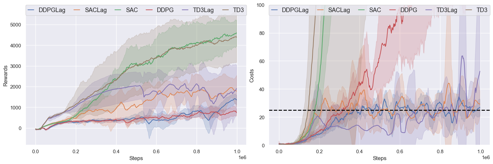
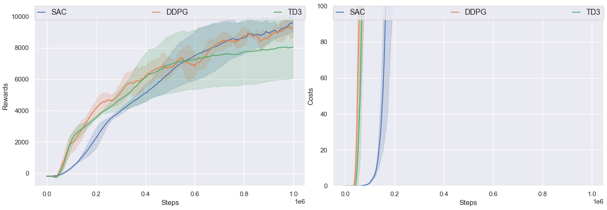
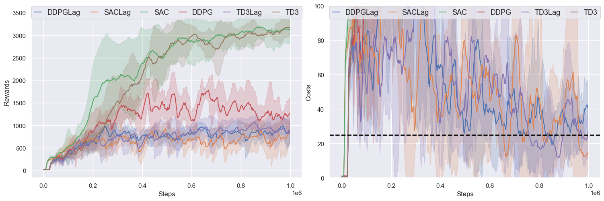
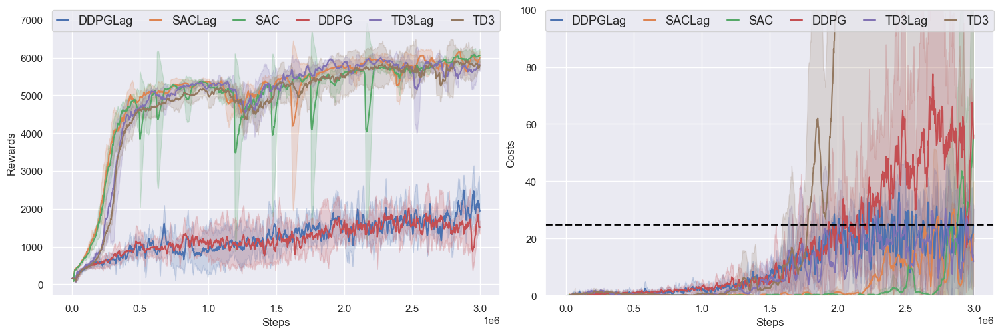
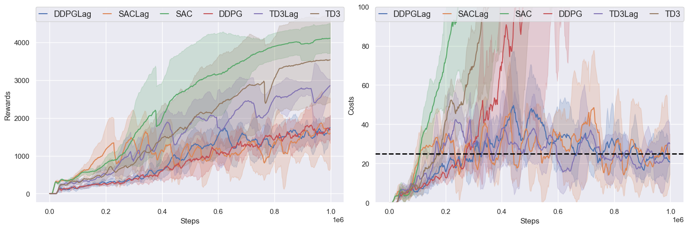

# OmniSafe's Mujoco Velocity Benchmark on Off-Policy Algorithms

OmniSafe's Mujoco Velocity Benchmark evaluated the performance of OmniSafe algorithm implementations in 6 environments from the Safety-Gymnasium task suite For each algorithm and environment supported, we provide:
- Default hyperparameters used for the benchmark and scripts to reproduce the results
- A comparison of performance or code-level details with other open-source implementations or classic papers.
- Graphs and raw data that can be used for research purposes, - Log details obtained during training
- Some hints on how to fine-tune the algorithm for optimal results.

Supported algorithms are listed below:
- [Deep Deterministic Policy Gradient (DDPG)](https://arxiv.org/pdf/1509.02971.pdf)
- [Twin Delayed DDPG (TD3)](https://arxiv.org/pdf/1802.09477.pdf)
- [Soft Actor-Critic (SAC)](https://arxiv.org/pdf/1812.05905.pdf)

## Safety-Gymnasium

We highly recommend using ``safety-gymnasium`` to run the following experiments. To install, in a linux machine, type:

```bash
pip install safety_gymnasium
```

## Run the Benchmark
You can set the main function of ``examples/benchmarks/experimrnt_grid.py`` as:

```python
    eg = ExperimentGrid(exp_name='Off-Policy-Velocity')

    # set up the algorithms.
    off_policy = ['DDPG', 'SAC', 'TD3']
    eg.add('algo', off_policy)

    # you can use wandb to monitor the experiment.
    eg.add('logger_cfgs:use_wandb', [False])
    # you can use tensorboard to monitor the experiment.
    eg.add('logger_cfgs:use_tensorboard', [True])

    # set up the environment.
    eg.add('env_id', [
        'SafetyHopperVelocity-v1',
        'SafetyWalker2dVelocity-v1',
        'SafetySwimmerVelocity-v1',
        'SafetyAntVelocity-v1',
        'SafetyHalfCheetahVelocity-v1',
        'SafetyHumanoidVelocity-v1'
        ])
    eg.add('seed', [0, 5, 10, 15, 20])
    eg.run(train, num_pool=5)
```

After that, you can run the following command to run the benchmark:

```bash
cd examples/benchmarks
python run_experiment_grid.py
```

You can also plot the results by running the following command:

```bash
cd examples
python plot.py --log-dir ALGODIR
```

e.g. ALGODIR can be ``examples/runs/SafetyHopperVelocity-v1``.
Then you can compare different algorithms in ``SafetyHopperVelocity-v1`` environments.

Logs is saved in `examples/benchmarks/runs` and can be monitored with tensorboard or wandb.

```bash
$ tensorboard --logdir examples/benchmarks/runs
```

After the experiment is finished, you can use the following command to generate the video of the trained agent:

```bash
cd examples
python evaluate_saved_policy.py
```
Please note that before you evaluate, please set the ``LOG_DIR`` in ``evaluate_saved_policy.py``.

For example, if I train ``DDPG`` in ``SafetyHumanoidVelocity-v1``

```python
    LOG_DIR = '~/omnisafe/examples/runs/DDPG-<SSafetyHumanoidVelocity-v1>/seed-000-2023-03-07-20-25-48'
    play = True
    save_replay = True
    if __name__ == '__main__':
        evaluator = omnisafe.Evaluator(play=play, save_replay=save_replay)
        for item in os.scandir(os.path.join(LOG_DIR, 'torch_save')):
            if item.is_file() and item.name.split('.')[-1] == 'pt':
                evaluator.load_saved(
                    save_dir=LOG_DIR, model_name=item.name, camera_name='track', width=256, height=256
                )
                evaluator.render(num_episodes=1)
                evaluator.evaluate(num_episodes=1)
```

## Example benchmark

<center>
    
    <br>
    <div style="color:orange; border-bottom: 1px solid #d9d9d9;
    display: inline-block;
    color: #999;
    padding: 2px;">SafetyAntVelocity-v1</div>
</center>

<center>
    
    <br>
    <div style="color:orange; border-bottom: 1px solid #d9d9d9;
    display: inline-block;
    color: #999;
    padding: 2px;">SafetyHalfCheetahVelocity-v1</div>
</center>

<center>
    
    <br>
    <div style="color:orange; border-bottom: 1px solid #d9d9d9;
    display: inline-block;
    color: #999;
    padding: 2px;">SafetyHopperVelocity-v1</div>
</center>

<center>
    
    <br>
    <div style="color:orange; border-bottom: 1px solid #d9d9d9;
    display: inline-block;
    color: #999;
    padding: 2px;">SafetyHumanoidVelocity-v1</div>
</center>

<center>
    
    <br>
    <div style="color:orange; border-bottom: 1px solid #d9d9d9;
    display: inline-block;
    color: #999;
    padding: 2px;">SafetyWalker2dVelocity-v1</div>
</center>

<center>
    
    <br>
    <div style="color:orange; border-bottom: 1px solid #d9d9d9;
    display: inline-block;
    color: #999;
    padding: 2px;">SafetySwimmerVelocity-v1</div>
</center>


## Experiment Analysis

### Hyperparameters

Off-Policy algorithms almost share the same hyperparameters, the share hyperparameters are listed below:

| Hyperparameter | Value |
| :------------: | :---: |
|   ``batch_size``   |  256  |
|    ``gamma``    |  0.99  |
|    ``size``    |  1000000  |
|    ``update_iters``    |  1  |
|    ``step_per_sample``    |  1  |
|    ``hidden_sizes``    |  [256, 256]  |

However, there are some differences between the three algorithms. We list the differences below:


### TD3

| Hyperparameter | Value |
| :------------: | :---: |
|   ``policy_noise``   |  0.2  |
|    ``noise_clip``    |  0.5  |
|    ``start_learning_steps``    |  25000  |

### SAC

| Hyperparameter | Value |
| :------------: | :---: |
|   ``alpha``   |  0.2  |
|    ``start_learning_steps``    |  5000  |


### Some Hints

In our experiments, we found that somehyperparameters are important for the performance of the algorithm:

- ``obs_normlize``: Whether to normalize the observation.
- ``rew_normlize``: Whether to normalize the reward.
- ``cost_normlize``: Whether to normalize the cost.

We have done some experiments to show the effect of these hyperparameters, and we log the best configuration for each algorithm in each environment. You can check it in the ``omnisafe/configs/off_policy``.

Besides, the hyperparameter ``train_cfgs:torch_num_threads`` is also important. Off-policy algorithms always use more time to update policy than to sample data. So we use ``torch_num_threads`` to speed up the update process.

This hyperparamter depens on the number of CPU cores. We set it to 8 in our experiments. You can set it to some other porper value according to your CPU cores.

If you find that other hyperparameters perform better, please feel free to open an issue or pull request.

### Experiment Results

### DDPG(1M)

| Environment | Reward (OmniSafe) | Cost (Omnisafe) |
| :---------: | :-----------: | :-----------: |
|     SafetyAntVelocity-v1     | **1243.15±619.17** | **289.80±161.52** |
| SafetyHalfCheetahVelocity-v1 | **9496.25±999.36** | **882.63±75.43** |
|    SafetyHopperVelocity-v1   | **2369.89±932.39** | **673.36±278.33** |
|   SafetyWalker2dVelocity-v1  | **1648.96±578.43** | **298.20±110.75** |
|   SafetySwimmerVelocity-v1   | **101.63±57.55** | **507.16±152.13** |
|   SafetyHumanoidVelocity-v1  | **3254.83±297.52** | **0.00±0.00** |

#### Hints for DDPG

DDPG only have one Q-network to estimate the Q-value. So it is easy to overestimate the Q-value. In our experiments, we found that the ``gamma`` is important for DDPG. If ``gamma`` is too large, the Q-value will not be overestimated. So we set ``gamma`` to 0.99 in our experiments.

| Environment | obs_normlize | rew_normlize | cost_normlize |
| :---------: | :-----------: |  :-----------: |  :-----------: |
|     SafetyAntVelocity-v1     | False | False | False |
| SafetyHalfCheetahVelocity-v1 | False | False | False |
|    SafetyHopperVelocity-v1   | False | False | False |
|    SafetyHumanoidVelocity-v1 | **True** | **True** | False |
|    SafetyWalker2dVelocity-v1 | False | False | False |
|    SafetySwimmerVelocity-v1  | False | True | False |

Please note that the ``cost_normlize`` make no sense for TD3, but work for TD3-Lag.

### TD3

| Environment | Reward (OmniSafe) | Cost (Omnisafe) |
| :---------: | :-----------: | :-----------: |
|     SafetyAntVelocity-v1     | **5107.66±619.95** | **978.33±4.41** |
| SafetyHalfCheetahVelocity-v1 | **8844.27±1812.2** | **981.43±1.08** |
|    SafetyHopperVelocity-v1   | **3567.15±109.79** | **977.43±19.14** |
|   SafetyWalker2dVelocity-v1  | **3962.93±355.76** | **904.83±21.69** |
|   SafetySwimmerVelocity-v1   | **81.98±31.23** | **678.66±240.35** |
|   SafetyHumanoidVelocity-v1  | **5245.66±674.81** | **0.00±0.00** |

#### Hints for TD3

| Environment | obs_normlize | rew_normlize | cost_normlize |
| :---------: | :-----------: |  :-----------: |  :-----------: |
|     SafetyAntVelocity-v1     | **True** | False | False |
| SafetyHalfCheetahVelocity-v1 | False | False | False |
|    SafetyHopperVelocity-v1   | False | False | False |
|    SafetyHumanoidVelocity-v1 | False | False | False |
|    SafetyWalker2dVelocity-v1 | False | False | False |
|    SafetySwimmerVelocity-v1  | False | **True** | False |

Please note that the ``cost_normlize`` make no sense for TD3, but work for TD3-Lag.

### SAC

| Environment | Reward (OmniSafe) | Cost (Omnisafe) |
| :---------: | :-----------: | :-----------: |
|     SafetyAntVelocity-v1     | **6061.45±129.37** | **929.53±7.10** |
| SafetyHalfCheetahVelocity-v1 | **10075.95±423.83** | **981.23±1.06** |
|    SafetyHopperVelocity-v1   | **3386.41±89.95** | **992.76±0.16** |
|   SafetyWalker2dVelocity-v1  | **4613.00±340.90** | **914.56±14.91** |
|   SafetySwimmerVelocity-v1   | **44.80±3.65** | **376.50±152.89** |
|   SafetyHumanoidVelocity-v1  | **5618.22±337.33** | **0.00±0.00** |

#### Hints for SAC

| Environment | obs_normlize | rew_normlize | cost_normlize |
| :---------: | :-----------: |  :-----------: |  :-----------: |
|     SafetyAntVelocity-v1     | False | False | False |
| SafetyHalfCheetahVelocity-v1 | False | False | False |
|    SafetyHopperVelocity-v1   | False | False | False |
|    SafetyHumanoidVelocity-v1 | False | False | False |
|    SafetyWalker2dVelocity-v1 | False | False | False |
|    SafetySwimmerVelocity-v1  | False | **True** | False |

Please note that the ``cost_normlize`` make no sense for TD3, but work for TD3-Lag.
