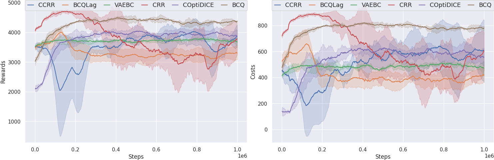

# OmniSafe's Mujoco Velocity Benchmark on Offline Algorithms

OmniSafe's Mujoco Velocity Benchmark evaluated the performance of OmniSafe's offline algorithm implementations in SafetyPointRun, SafetyPointCirlce, SafetyCarRun, SafetyCarCircle from the Safety-Gymnasium task suite. For each algorithm and environment supported, we provide:

- Default hyperparameters used for the benchmark and scripts to reproduce the results.
- A comparison of performance or code-level details with other open-source implementations or classic papers.
- Graphs and raw data that can be used for research purposes.
- Log details obtained during training.
- Some hints on how to fine-tune the algorithm for optimal results.

Supported algorithms are listed below:

- **[ICML 2019]** [Batch-Constrained deep Q-learning(BCQ)](https://arxiv.org/pdf/1812.02900.pdf)
- [The Lagrange version of BCQ (BCQ-Lag)](https://arxiv.org/pdf/1812.02900.pdf)
- **[NeurIPS 2020]** [Critic Regularized Regression](https://proceedings.neurips.cc//paper/2020/file/588cb956d6bbe67078f29f8de420a13d-Paper.pdf)
- [The Constrained version of CRR (C-CRR)](https://proceedings.neurips.cc/paper/2020/hash/588cb956d6bbe67078f29f8de420a13d-Abstract.html)
- **[ICLR 2022 (Spotlight)]** [COptiDICE: Offline Constrained Reinforcement Learning via Stationary Distribution Correction Estimation](https://arxiv.org/abs/2204.08957?context=cs.AI)

## Safety-Gymnasium

We highly recommend using ``safety-gymnasium`` to run the following experiments. To install, in a linux machine, type:

```bash
pip install safety_gymnasium
```

## Training agents used to generate data

```bash
omnisafe train --env-id SafetyAntVelocity-v1 --algo PPO
omnisafe train --env-id SafetyAntVelocity-v1 --algo PPOLag
```

## Collect offline data

```python
from omnisafe.common.offline.data_collector import OfflineDataCollector


# please change agent path
env_name = 'SafetyAntVelocity-v1'
size = 1_000_000
agents = [
    ('./runs/PPO', 'epoch-500', 500_000),
    ('./runs/PPOLag', 'epoch-500', 500_000),
]
save_dir = './data'

if __name__ == '__main__':
    col = OfflineDataCollector(size, env_name)
    for agent, model_name, num in agents:
        col.register_agent(agent, model_name, num)
    col.collect(save_dir)
```

## Run the Benchmark

You can set the main function of ``examples/benchmarks/experimrnt_grid.py`` as:

```python
if __name__ == '__main__':
    eg = ExperimentGrid(exp_name='offline-Benchmarks')

    # set up the algorithms.
    offline_policy = ['VAEBC', 'BCQ', 'BCQLag', 'CCR', 'CCRR', 'COptiDICE']

    eg.add('algo', offline_policy)

    # you can use wandb to monitor the experiment.
    eg.add('logger_cfgs:use_wandb', [False])
    # you can use tensorboard to monitor the experiment.
    eg.add('logger_cfgs:use_tensorboard', [True])
    # add dataset path
    eg.add('train_cfgs:dataset', [dataset_path])

    # set up the environment.
    eg.add('env_id', [
        'SafetyAntVelocity-v1',
        ])
    eg.add('seed', [0, 5, 10, 15, 20])

    # total experiment num must can be divided by num_pool
    # meanwhile, users should decide this value according to their machine
    eg.run(train, num_pool=5)
```

After that, you can run the following command to run the benchmark:

```bash
cd examples/benchmarks
python run_experiment_grid.py
```

You can also plot the results by running the following command:

```bash
cd examples
python plot.py --log-dir ALGODIR
```

## Example benchmark

<center>
    
    <br>
    <div style="color:orange; border-bottom: 1px solid #d9d9d9;
    display: inline-block;
    color: #999;
    padding: 2px;">SafetyAntVelocity-v1(1e6)</div>
</center>

## Some Insights

1. The Lagrange method is widely recognized as the simplest approach for implementing safe algorithms. However, its efficacy is limited in offline settings. This is due to the fact that the q-critic, which is based on TD-learning, cannot ensure the absolute accuracy of the q value. Since the policy relies on the q value, relative accuracy is sufficient for learning the appropriate state. However, for the Lagrange-based algorithm to acquire meaningful Lagrange multipliers, it requires q values that are absolutely accurate.
2. Currently, there exists no standardized data set for safe offline evaluation algorithms. This lack of uniformity renders the existing algorithm sensitive to the data set employed. When the data set comprises a significant number of unsafe trajectories, the algorithm struggles to learn the safe performance. We advocate for a construction method that involves training two online policies: one offering a high reward but lacking safety assurances, and the other offering a slightly lower reward but ensuring safety. The two policies are then used to collect data sets in a 1:1 ratio.
