# OmniSafe's Mujoco Velocity Benchmark on On-Policy Algorithms

OmniSafe's Mujoco Velocity Benchmark evaluated the performance of OmniSafe algorithm implementations in 6 environments from the Safety-Gymnasium task suite For each algorithm and environment supported, we provide:
- Default hyperparameters used for the benchmark and scripts to reproduce the results
- A comparison of performance or code-level details with other open-source implementations or classic papers.
- Graphs and raw data that can be used for research purposes, - Log details obtained during training
- Some hints on how to fine-tune the algorithm for optimal results.

Supported algorithms are listed below:

**First-Order**

- **[NIPS 1999]** [Policy Gradient(PG)](https://papers.nips.cc/paper/1999/file/464d828b85b0bed98e80ade0a5c43b0f-Paper.pdf)
- [Proximal Policy Optimization (PPO)](https://arxiv.org/pdf/1707.06347.pdf)
- [The Lagrange version of PPO (PPO-Lag)](https://cdn.openai.com/safexp-short.pdf)
- **[IJCAI 2022]** [Penalized Proximal Policy Optimization for Safe Reinforcement Learning(P3O)]( https://arxiv.org/pdf/2205.11814.pdf)
- **[NeurIPS 2020]** [First Order Constrained Optimization in Policy Space (FOCOPS)](https://arxiv.org/abs/2002.06506)
- **[NeurIPS 2022]**  [Constrained Update Projection Approach to Safe Policy Optimization (CUP)](https://arxiv.org/abs/2209.07089)

**Second-Order**

- **[NeurIPS 2001]** [A Natural Policy Gradient (NaturalPG))](https://proceedings.neurips.cc/paper/2001/file/4b86abe48d358ecf194c56c69108433e-Paper.pdf)
- **[PMLR 2015]** [Trust Region Policy Optimization (TRPO)](https://arxiv.org/abs/1502.05477)
- [The Lagrange version of TRPO (TRPO-Lag)](https://cdn.openai.com/safexp-short.pdf)
- **[ICML 2017]** [Constrained Policy Optimization (CPO)](https://proceedings.mlr.press/v70/achiam17a)
- **[ICML 2017]** [Proximal Constrained Policy Optimization (PCPO)](https://proceedings.mlr.press/v70/achiam17a)
- **[ICLR 2019]** [Reward Constrained Policy Optimization (RCPO)](https://openreview.net/forum?id=SkfrvsA9FX)

## Safety-Gymnasium

We highly recommend using ``safety-gymnasium`` to run the following experiments. To install, in a linux machine, type:

```bash
pip install safety_gymnasium
```

## Run the Benchmark

You can set the main function of ``examples/benchmarks/experimrnt_grid.py`` as:

```python
if __name__ == '__main__':
    eg = ExperimentGrid(exp_name='On-Policy-Benchmarks')

    # set up the algorithms.
    base_policy = ['PolicyGradient', 'NaturalPG', 'TRPO', 'PPO']
    naive_lagrange_policy = ['PPOLag', 'TRPOLag', 'RCPO', 'OnCRPO', 'PDO']
    first_order_policy = ['CUP', 'FOCOPS', 'P3O']
    second_order_policy = ['CPO', 'PCPO']

    eg.add('algo', base_policy + naive_lagrange_policy + first_order_policy + second_order_policy)

    # you can use wandb to monitor the experiment.
    eg.add('logger_cfgs:use_wandb', [False])
    # you can use tensorboard to monitor the experiment.
    eg.add('logger_cfgs:use_tensorboard', [True])

    # set up the environment.
    eg.add('env_id', [
        'SafetyHopperVelocity-v1',
        'SafetyWalker2dVelocity-v1',
        'SafetySwimmerVelocity-v1',
        'SafetyAntVelocity-v1',
        'SafetyHalfCheetahVelocity-v1',
        'SafetyHumanoidVelocity-v1'
        ])
    eg.add('seed', [0, 5, 10, 15, 20])

    # total experiment num must can be divided by num_pool
    # meanwhile, users should decide this value according to their machine
    eg.run(train, num_pool=5)
```

After that, you can run the following command to run the benchmark:

```bash
cd examples/benchmarks
python run_experiment_grid.py
```

You can also plot the results by running the following command:

```bash
cd examples
python plot.py --log-dir ALGODIR
```

e.g. ALGODIR can be ``examples/runs/SafetyHopperVelocity-v1``.
Then you can compare different algorithms in ``SafetyHopperVelocity-v1`` environments.

Logs is saved in `examples/benchmarks/runs` and can be monitored with tensorboard or wandb.

```bash
$ tensorboard --logdir examples/benchmarks/runs
```

After the experiment is finished, you can use the following command to generate the video of the trained agent:

```bash
cd examples
python evaluate_saved_policy.py
```
Please note that before you evaluate, please set the ``LOG_DIR`` in ``evaluate_saved_policy.py``.

For example, if I train ``PPOLag`` in ``SafetyHumanoidVelocity-v1``

```python
    LOG_DIR = '~/omnisafe/examples/runs/PPOLag-<SafetyHumanoidVelocity-v1>/seed-000-2023-03-07-20-25-48'
    play = True
    save_replay = True
    if __name__ == '__main__':
        evaluator = omnisafe.Evaluator(play=play, save_replay=save_replay)
        for item in os.scandir(os.path.join(LOG_DIR, 'torch_save')):
            if item.is_file() and item.name.split('.')[-1] == 'pt':
                evaluator.load_saved(
                    save_dir=LOG_DIR, model_name=item.name, camera_name='track', width=256, height=256
                )
                evaluator.render(num_episodes=1)
                evaluator.evaluate(num_episodes=1)
```

## Example benchmark

<center>
    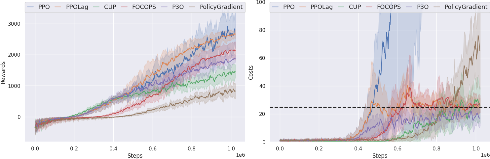
    <br>
    <div style="color:orange; border-bottom: 1px solid #d9d9d9;
    display: inline-block;
    color: #999;
    padding: 2px;">SafetyAntVelocity-v1(1e6)</div>
</center>

<center>
    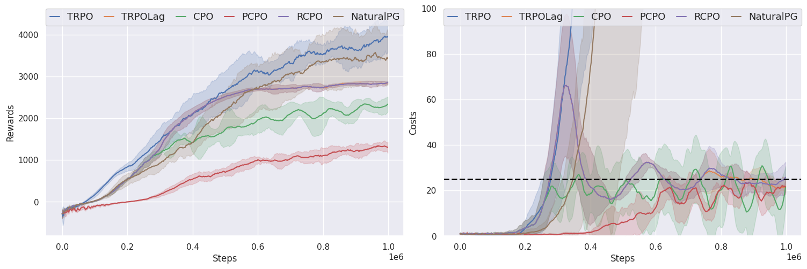
    <br>
    <div style="color:orange; border-bottom: 1px solid #d9d9d9;
    display: inline-block;
    color: #999;
    padding: 2px;">SafetyAntVelocity-v1(1e6)</div>
</center>

<center>
    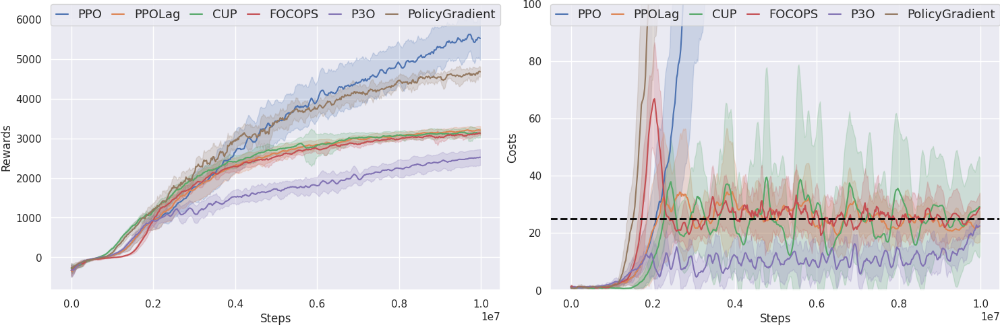
    <br>
    <div style="color:orange; border-bottom: 1px solid #d9d9d9;
    display: inline-block;
    color: #999;
    padding: 2px;">SafetyAntVelocity-v1(1e7)</div>
</center>

<center>
    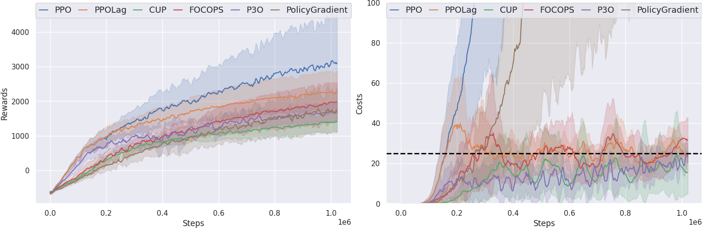
    <br>
    <div style="color:orange; border-bottom: 1px solid #d9d9d9;
    display: inline-block;
    color: #999;
    padding: 2px;">SafetyHalfCheetahVelocity-v1(1e6)</div>
</center>

<center>
    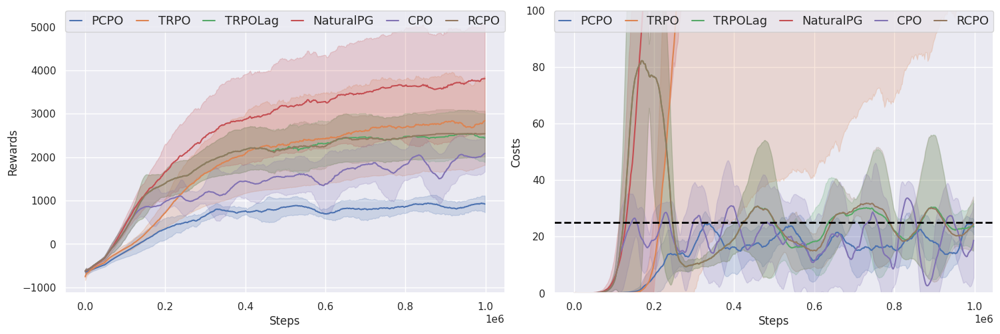
    <br>
    <div style="color:orange; border-bottom: 1px solid #d9d9d9;
    display: inline-block;
    color: #999;
    padding: 2px;">SafetyHalfCheetahVelocity-v1(1e6)</div>
</center>

<center>
    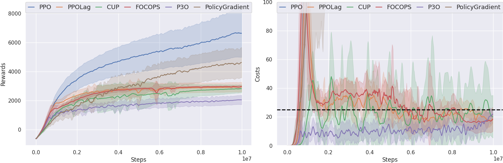
    <br>
    <div style="color:orange; border-bottom: 1px solid #d9d9d9;
    display: inline-block;
    color: #999;
    padding: 2px;">SafetyHalfCheetahVelocity-v1(1e7)</div>
</center>

<center>
    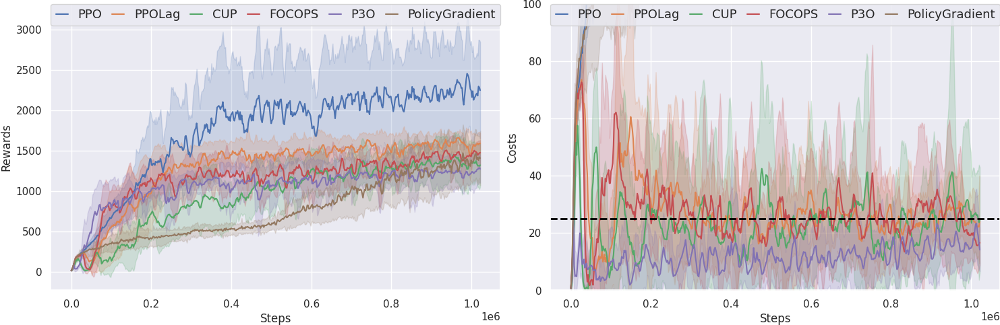
    <br>
    <div style="color:orange; border-bottom: 1px solid #d9d9d9;
    display: inline-block;
    color: #999;
    padding: 2px;">SafetyHopperVelocity-v1(1e6)</div>
</center>

<center>
    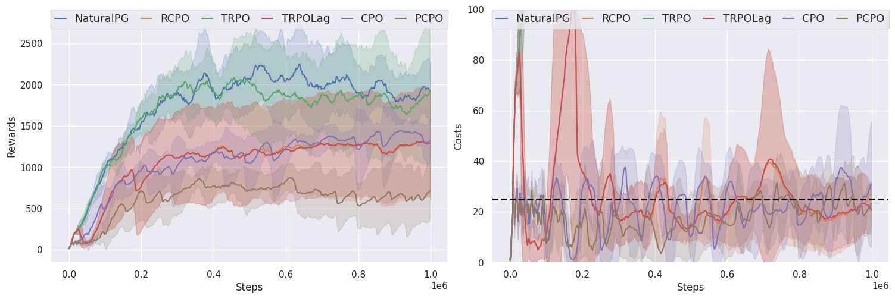
    <br>
    <div style="color:orange; border-bottom: 1px solid #d9d9d9;
    display: inline-block;
    color: #999;
    padding: 2px;">SafetyHopperVelocity-v1(1e6)</div>
</center>

<center>
    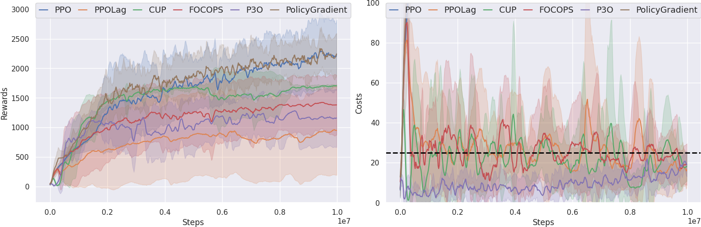
    <br>
    <div style="color:orange; border-bottom: 1px solid #d9d9d9;
    display: inline-block;
    color: #999;
    padding: 2px;">SafetyHopperVelocity-v1(1e7)</div>
</center>

<center>
    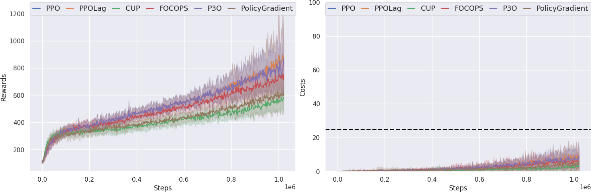
    <br>
    <div style="color:orange; border-bottom: 1px solid #d9d9d9;
    display: inline-block;
    color: #999;
    padding: 2px;">SafetyHumanoidVelocity-v1(1e6)</div>
</center>

<center>
    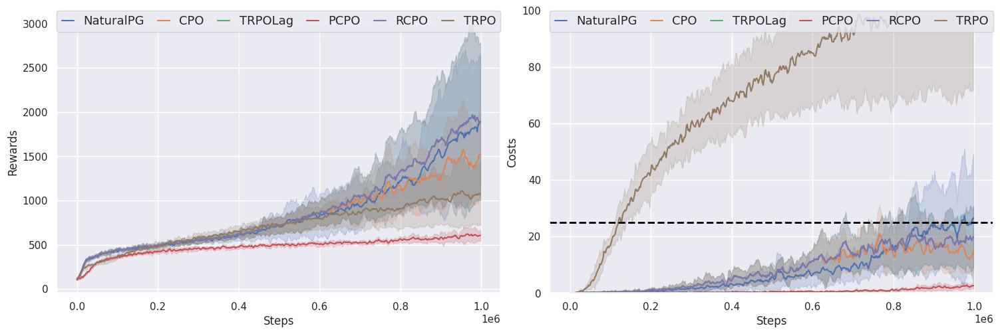
    <br>
    <div style="color:orange; border-bottom: 1px solid #d9d9d9;
    display: inline-block;
    color: #999;
    padding: 2px;">SafetyHumanoidVelocity-v1(1e6)</div>
</center>

<center>
    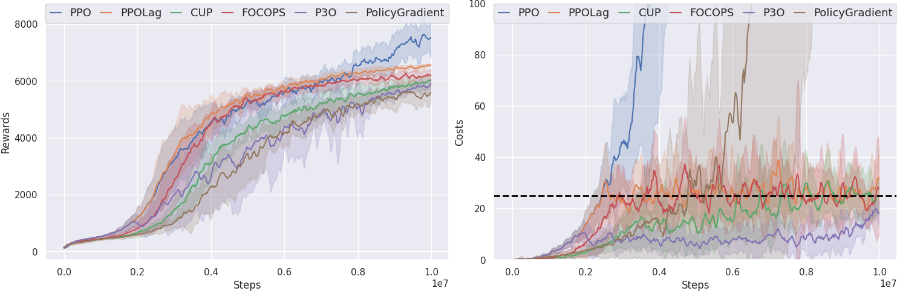
    <br>
    <div style="color:orange; border-bottom: 1px solid #d9d9d9;
    display: inline-block;
    color: #999;
    padding: 2px;">SafetyHumanoidVelocity-v1(1e7)</div>
</center>

<center>
    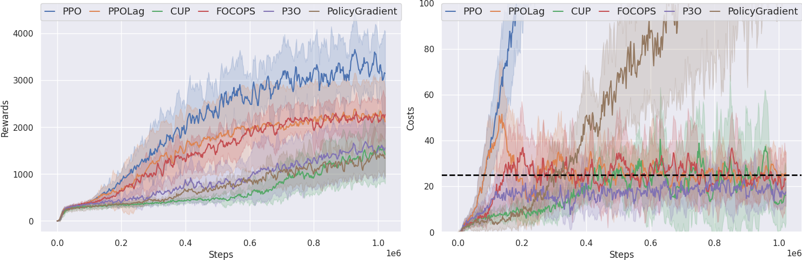
    <br>
    <div style="color:orange; border-bottom: 1px solid #d9d9d9;
    display: inline-block;
    color: #999;
    padding: 2px;">SafetyWalker2dVelocity-v1(1e6)</div>
</center>

<center>
    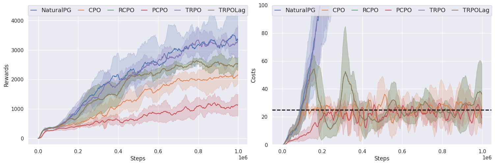
    <br>
    <div style="color:orange; border-bottom: 1px solid #d9d9d9;
    display: inline-block;
    color: #999;
    padding: 2px;">SafetyWalker2dVelocity-v1(1e6)</div>
</center>

<center>
    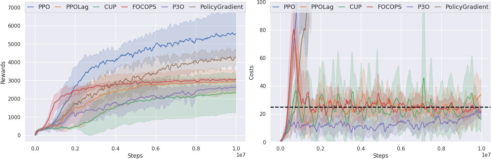
    <br>
    <div style="color:orange; border-bottom: 1px solid #d9d9d9;
    display: inline-block;
    color: #999;
    padding: 2px;">SafetyWalker2dVelocity-v1(1e7)</div>
</center>

<center>
    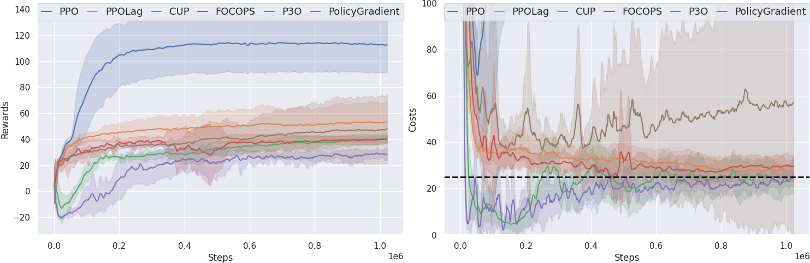
    <br>
    <div style="color:orange; border-bottom: 1px solid #d9d9d9;
    display: inline-block;
    color: #999;
    padding: 2px;">SafetySwimmerVelocity-v1(1e6)</div>
</center>

<center>
    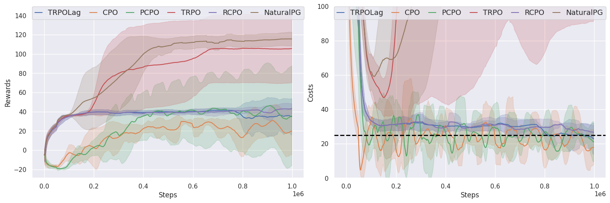
    <br>
    <div style="color:orange; border-bottom: 1px solid #d9d9d9;
    display: inline-block;
    color: #999;
    padding: 2px;">SafetySwimmerVelocity-v1(1e6)</div>
</center>

<center>
    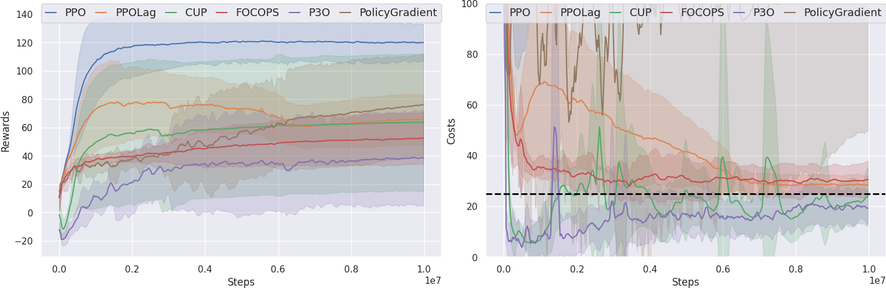
    <br>
    <div style="color:orange; border-bottom: 1px solid #d9d9d9;
    display: inline-block;
    color: #999;
    padding: 2px;">SafetySwimmerVelocity-v1(1e7)</div>
</center>

<center>
    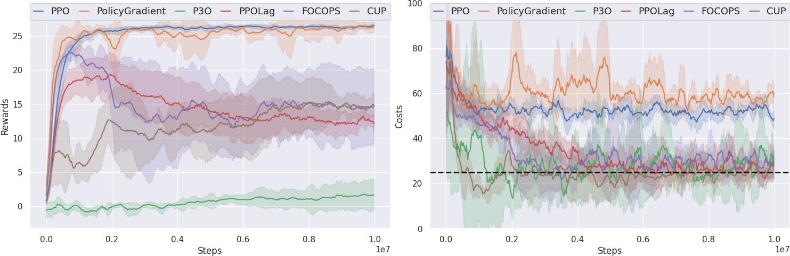
    <br>
    <div style="color:orange; border-bottom: 1px solid #d9d9d9;
    display: inline-block;
    color: #999;
    padding: 2px;">SafetyPointGoal1-v0(1e7)</div>
</center>

<center>
    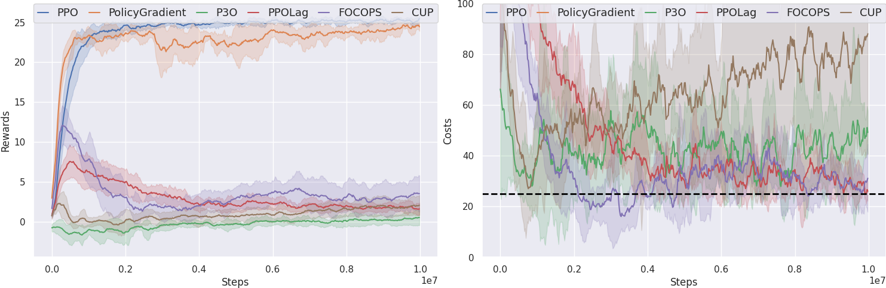
    <br>
    <div style="color:orange; border-bottom: 1px solid #d9d9d9;
    display: inline-block;
    color: #999;
    padding: 2px;">SafetyPointGoal2-v0(1e7)</div>
</center>

<center>
    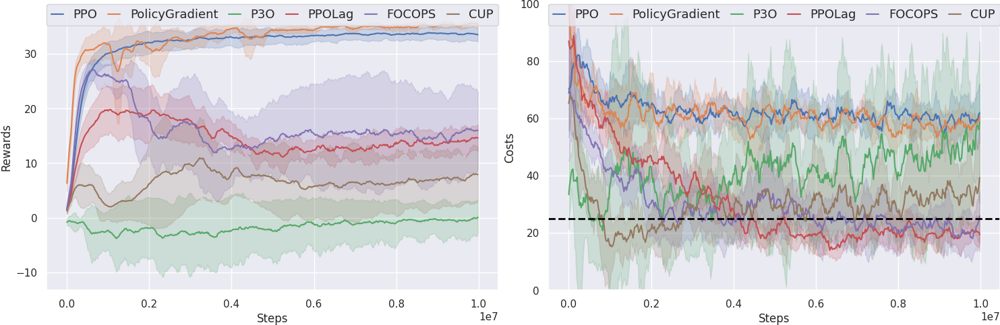
    <br>
    <div style="color:orange; border-bottom: 1px solid #d9d9d9;
    display: inline-block;
    color: #999;
    padding: 2px;">SafetyCarGoal1-v0(1e7)</div>
</center>

<center>
    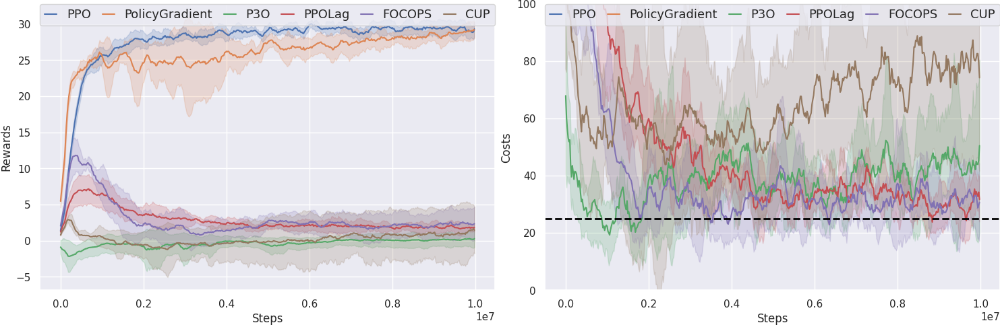
    <br>
    <div style="color:orange; border-bottom: 1px solid #d9d9d9;
    display: inline-block;
    color: #999;
    padding: 2px;">SafetyCarGoal2-v0(1e7)</div>
</center>

<center>
    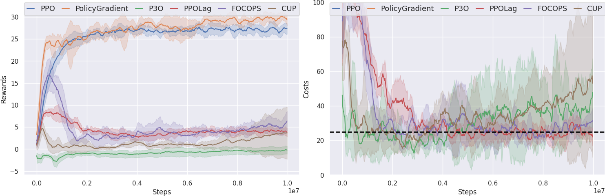
    <br>
    <div style="color:orange; border-bottom: 1px solid #d9d9d9;
    display: inline-block;
    color: #999;
    padding: 2px;">SafetyPointButton1-v0(1e7)</div>
</center>

<center>
    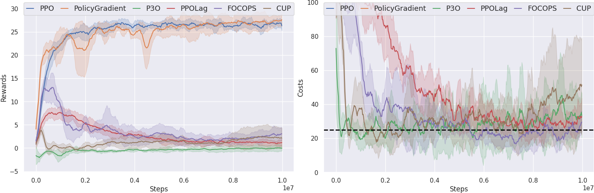
    <br>
    <div style="color:orange; border-bottom: 1px solid #d9d9d9;
    display: inline-block;
    color: #999;
    padding: 2px;">SafetyPointButton2-v0(1e7)</div>
</center>

<center>
    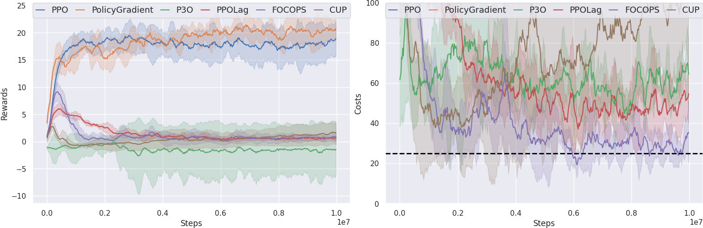
    <br>
    <div style="color:orange; border-bottom: 1px solid #d9d9d9;
    display: inline-block;
    color: #999;
    padding: 2px;">SafetyCarButton1-v0(1e7)</div>
</center>

<center>
    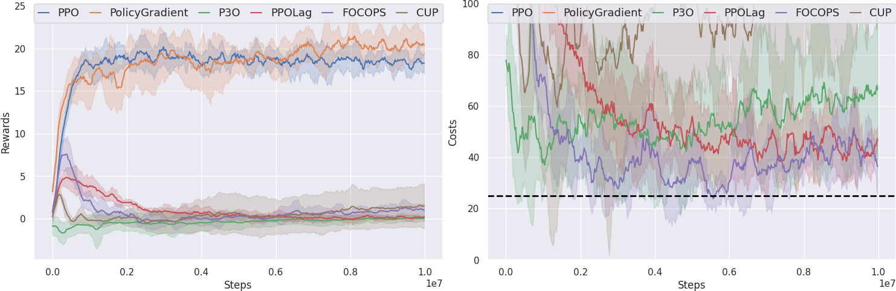
    <br>
    <div style="color:orange; border-bottom: 1px solid #d9d9d9;
    display: inline-block;
    color: #999;
    padding: 2px;">SafetyCarButton2-v0(1e7)</div>
</center>


## Experiment Analysis

### Hyperparameters

#### First-Order Methods Specific Hyperparameters

**We are continuously improving performance for first-order algorithms and finding better hyperparameters and will release an ultimate version as soon as possible. Meanwhile, we are happy to receive any advice from users, feel free for opening PRs or issues.**

#### Second-Order Methods Specific Hyperparameters

- ``algo_cfgs:kl_early_stop``: Whether to use early stop for KL divergence. In the second-order methods, we use line search to find the proper step size. If the KL divergence is too large, we will stop the line search and use the previous step size. So we always set this hyperparameter to ``False``.

- ``model_cfgs:actor:lr``: The learning rate of the actor network. The second-order methods use the actor network update the policy by directly setting the parameters of the policy network. So we do not need to set the learning rate of the policy network, which is set to ``None``.

### Some Hints

In our experiments, we found that somehyperparameters are important for the performance of the algorithm:

- ``obs_normlize``: Whether to normalize the observation.
- ``rew_normlize``: Whether to normalize the reward.
- ``cost_normlize``: Whether to normalize the cost.

We have done some experiments to show the effect of these hyperparameters, and we log the best configuration for each algorithm in each environment. You can check it in the ``omnisafe/configs/on_policy``.

In experiments, we found that the ``obs_normlize=True`` always performs better than ``obs_normlize=False`` in the second-order methods. That means the reward would increase quicker if we normalize the observation. So we set ``obs_normlize=True`` in almost all the second-order methods.

Importantly, we found that the ``rew_normlize=True`` not always performs better than ``rew_normlize=False``, especially in the ``SafetyHopperVelocity-v1`` and ``SafetyWalker2dVelocity`` environment.

The Lagrangian method often has the phenomenon of unstable update and easy overshoot。 We found that with ``cost_normlize=True``, the Lagrangian method can update more stable and avoid overshoot to some degree. So we set ``cost_normlize=True`` in the Lagrangian method.

Besides, the hyperparameter ``train_cfgs:torch_num_threads`` is also important. on-policy algorithms always use more time to update policy than to sample data. So we use ``torch_num_threads`` to speed up the update process.

This hyperparamter depens on the number of CPU cores. We set it to 8 in our experiments. You can set it to some other porper value according to your CPU cores.

If you find that other hyperparameters perform better, please feel free to open an issue or pull request.

### First-Order Algorithms Experiment Results

### PG(1M)

|         Environment          | Reward (OmniSafe) | Cost (Omnisafe) |
| :--------------------------: | :---------------: | :-------------: |
|     SafetyAntVelocity-v1     |   858.23±560.39   |   68.27±59.44   |
| SafetyHalfCheetahVelocity-v1 |   1659.58±814.3   |   314.25±212.57 |
|   SafetyHopperVelocity-v1    |   1600.12±650.83  |   465.24±193.57 |
|  SafetyWalker2dVelocity-v1   |   1438.59±811.74  |   204.65±158.58 |
|   SafetySwimmerVelocity-v1   |   47.45±25.17     |   55.66±53.26   |
|  SafetyHumanoidVelocity-v1   |   615.56±219.51   |    5.25±9.7     |

### PG(10M)

|         Environment          | Reward (OmniSafe) | Cost (Omnisafe) |
| :--------------------------: | :---------------: | :-------------: |
|     SafetyAntVelocity-v1     |   4740.04±770.86  |   902.88±151.01 |
| SafetyHalfCheetahVelocity-v1 |   4564.63±1251.58 |   853.26±222.4  |
|   SafetyHopperVelocity-v1    |   2200.08±906.16  |   588.28±254.18 |
|  SafetyWalker2dVelocity-v1   |   4366.36±1060.97 |   780.65±180.65 |
|   SafetySwimmerVelocity-v1   |     75.85±34.01   |   116.96±65.19  |
|  SafetyHumanoidVelocity-v1   |    5689.59±1578.32|    597.04±315.8 |
|   SafetyPointGoal1-v0        |   26.63±1.27      |   59.06±31.33   |
|   SafetyPointGoal2-v0        |   24.21±3.85      |   204.96±104.97 |
|   SafetyCarGoal1-v0          |   36.08±2.02      |   63.74±51.7    |
|   SafetyCarGoal2-v0          |   29.46±4.03      |    205.22±78.21 |
|   SafetyPointButton1-v0      |   29.97±6.3       |   145.02±94.54  |
|   SafetyPointButton2-v0      |   27.87±4.88      |   152.48±76.25  |
|   SafetyCarButton1-v0        |   20.12±10.27     |   332.34±187.49 |
|   SafetyCarButton2-v0        |   17.87±11.27     |   367.76±195.48 |

### PPO(1M)

|         Environment          | Reward (OmniSafe) | Cost (Omnisafe) |
| :--------------------------: | :---------------: | :-------------: |
|     SafetyAntVelocity-v1     |   2831.88±1242.25 |   576.84±285.03 |
| SafetyHalfCheetahVelocity-v1 |   3100.31±1403.77 |   595.97±325.07 |
|   SafetyHopperVelocity-v1    |    2323.12±929.72 |   612.24±253.16 |
|  SafetyWalker2dVelocity-v1   |    3442.6±1507.25 |   652.75±291.44 |
|   SafetySwimmerVelocity-v1   |     112.35±20.57  |   153.68±37.3   |
|  SafetyHumanoidVelocity-v1   |    876.06±380.75  |    11.71±14.78  |

### PPO(10M)

|         Environment          | Reward (OmniSafe) | Cost (Omnisafe) |
| :--------------------------: | :---------------: | :-------------: |
|     SafetyAntVelocity-v1     |   5667.14±942.66  |   942.57±152.14 |
| SafetyHalfCheetahVelocity-v1 |   6678.42±1640.91 |   914.97±176.39 |
|   SafetyHopperVelocity-v1    |    2148.43±917.65 |   505.95±231.22 |
|  SafetyWalker2dVelocity-v1   |    5736.48±1413.97|   840.55±190.32 |
|   SafetySwimmerVelocity-v1   |     119.81±13.11  |   166.42±18.09  |
|  SafetyHumanoidVelocity-v1   |    7777.96±1748.55|    861.78±187.85|
|   SafetyPointGoal1-v0        |   26.32±1.18      |   48.2±36.32    |
|   SafetyPointGoal2-v0        |   26.43±1.86      |   159.28±87.13  |
|   SafetyCarGoal1-v0          |   33.67±2.95      |   59.42±39.63   |
|   SafetyCarGoal2-v0          |   30.09±4.84      |   216.64±90.29  |
|   SafetyPointButton1-v0      |   26.1±5.61       |   151.38±89.61  |
|   SafetyPointButton2-v0      |   27.96±4.94      |   166.74±64.6   |
|   SafetyCarButton1-v0        |   16.69±9.76      |   402.28±191.59 |
|   SafetyCarButton2-v0        |   18.45±9.51      |   328.64±170.09 |

### PPOLag(1M)

|         Environment          | Reward (OmniSafe) | Cost (Omnisafe) |
| :--------------------------: | :---------------: | :-------------: |
|     SafetyAntVelocity-v1     |   2643.2±303.57   |    23.55±8.05   |
| SafetyHalfCheetahVelocity-v1 |   2213.62±665.4   |     23.3±9.02   |
|   SafetyHopperVelocity-v1    |    1630.06±253.7  |    28.31±25.87  |
|  SafetyWalker2dVelocity-v1   |    2256.96±944.06 |    25.47±17.36  |
|   SafetySwimmerVelocity-v1   |     53.18±14.58   |    27.74±5.29   |
|  SafetyHumanoidVelocity-v1   |    841.84±302.61  |    8.19±11.65   |
|   SafetyPointGoal1-v0        |   1600.12±650.83  |   465.24±193.57 |
|   SafetyPointGoal2-v0        |   1438.59±811.74  |   204.65±158.58 |
|   SafetyCarGoal1-v0          |   47.45±25.17     |   55.66±53.26   |
|   SafetyCarGoal2-v0          |   615.56±219.51   |    5.25±9.7     |
|   SafetyPointButton1-v0      |   1600.12±650.83  |   465.24±193.57 |
|   SafetyPointButton2-v0      |   1438.59±811.74  |   204.65±158.58 |
|   SafetyCarButton1-v0        |   47.45±25.17     |   55.66±53.26   |
|   SafetyCarButton2-v0        |   615.56±219.51   |    5.25±9.7     |

### PPOLag(10M)

|         Environment          | Reward (OmniSafe) | Cost (Omnisafe) |
| :--------------------------: | :---------------: | :-------------: |
|     SafetyAntVelocity-v1     |   3230.19±85.06   |    22.14±8.73   |
| SafetyHalfCheetahVelocity-v1 |   2939.65±309.22  |     20.07±6.35  |
|   SafetyHopperVelocity-v1    |    931.46±749.53  |    15.8±20.67   |
|  SafetyWalker2dVelocity-v1   |    2897.17±806.23 |    33.19±19.04  |
|   SafetySwimmerVelocity-v1   |     65.83±17.08   |    28.42±4.35   |
|  SafetyHumanoidVelocity-v1   |    6501.24±568.04 |    28.95±22.43  |
|   SafetyPointGoal1-v0        |   12.6±5.74       |   34.78±51.85   |
|   SafetyPointGoal2-v0        |   1.77±3.72       |   20.0±49.84    |
|   SafetyCarGoal1-v0          |   12.32±8.17      |   19.34±27.36   |
|   SafetyCarGoal2-v0          |   1.49±2.38       |    41.04±102.2  |
|   SafetyPointButton1-v0      |   5.57±4.46       |   32.22±40.1    |
|   SafetyPointButton2-v0      |   2.04±3.15       |   26.74±44.77   |
|   SafetyCarButton1-v0        |   1.08±2.72       |   32.1±49.06    |
|   SafetyCarButton2-v0        |   -0.01±2.44      |    39.1±50.7    |

### P3O(1M)

|         Environment          | Reward (OmniSafe) | Cost (Omnisafe) |
| :--------------------------: | :---------------: | :-------------: |
|     SafetyAntVelocity-v1     |   1835.38±357.9   |    18.06±10.26  |
| SafetyHalfCheetahVelocity-v1 |   1668.45±297.64  |    20.01±9.03   |
|   SafetyHopperVelocity-v1    |    1285.99±220.5  |    14.99±15.63  |
|  SafetyWalker2dVelocity-v1   |   1547.39±737.5   |    16.58±16.29  |
|   SafetySwimmerVelocity-v1   |     27.46±8.8     |   22.98±8.57    |
|  SafetyHumanoidVelocity-v1   |   806.66±263.83   |     8.87±12.4   |

### P3O(10M)

|         Environment          | Reward (OmniSafe) | Cost (Omnisafe) |
| :--------------------------: | :---------------: | :-------------: |
|     SafetyAntVelocity-v1     |   1835.38±357.9   |    18.06±10.26  |
| SafetyHalfCheetahVelocity-v1 |   1668.45±297.64  |    20.01±9.03   |
|   SafetyHopperVelocity-v1    |    1285.99±220.5  |    14.99±15.63  |
|  SafetyWalker2dVelocity-v1   |   1547.39±737.5   |    16.58±16.29  |
|   SafetySwimmerVelocity-v1   |     27.46±8.8     |   22.98±8.57    |
|  SafetyHumanoidVelocity-v1   |   806.66±263.83   |     8.87±12.4   |
|   SafetyPointGoal1-v0        |   1.77±3.42       |   16.76±21.57   |
|   SafetyPointGoal2-v0        |   0.45±2.13       |   92.62±143.59  |
|   SafetyCarGoal1-v0          |   -0.43±6.51      |   34.14±103.54  |
|   SafetyCarGoal2-v0          |   0.07±1.52       |   22.26±40.84   |
|   SafetyPointButton1-v0      |   -0.5±1.46       |   30.88±71.69   |
|   SafetyPointButton2-v0      |   0.02±1.44       |   30.66±46.61   |
|   SafetyCarButton1-v0        |   -1.45±5.85      |   34.04±68.05   |
|   SafetyCarButton2-v0        |   -0.14±0.65      |    45.4±81.36   |

### FOCOPS(1M)

|         Environment          | Reward (OmniSafe) | Cost (Omnisafe) |
| :--------------------------: | :---------------: | :-------------: |
|     SafetyAntVelocity-v1     |   2175.39±334.07  |     27.15±9.69  |
| SafetyHalfCheetahVelocity-v1 |   1953.34±574.51  |    30.88±11.66  |
|   SafetyHopperVelocity-v1    |    1462.06±363.06 |    18.35±15.15  |
|  SafetyWalker2dVelocity-v1   |    2194.62±732.01 |    29.61±32.1   |
|   SafetySwimmerVelocity-v1   |     39.46±3.92    |   29.05±5.31    |
|  SafetyHumanoidVelocity-v1   |    761.98±267.66  |    5.85±8.55    |

### FOCOPS(10M)

|         Environment          | Reward (OmniSafe) | Cost (Omnisafe) |
| :--------------------------: | :---------------: | :-------------: |
|     SafetyAntVelocity-v1     |   3161.01±41.51   |     29.48±8.93  |
| SafetyHalfCheetahVelocity-v1 |   2977.44±55.91   |    18.34±9.44   |
|   SafetyHopperVelocity-v1    |    1367.59±523.66 |    17.25±12.21  |
|  SafetyWalker2dVelocity-v1   |    3083.97±243.19 |    24.65±16.66  |
|   SafetySwimmerVelocity-v1   |     52.51±17.41   |   30.09±7.14    |
|  SafetyHumanoidVelocity-v1   |    6275.47±595.52 |    25.5±16.81   |
|   SafetyPointGoal1-v0        |   15.1±8.95       |   18.12±23.11   |
|   SafetyPointGoal2-v0        |   2.59±4.63       |   18.9±37.46    |
|   SafetyCarGoal1-v0          |   16.05±12.76     |   18.74±30.09   |
|   SafetyCarGoal2-v0          |   1.87±3.8        |    29.46±68.83  |
|   SafetyPointButton1-v0      |   6.18±6.84       |   27.86±42.79   |
|   SafetyPointButton2-v0      |   2.71±5.11       |   18.06±35.4    |
|   SafetyCarButton1-v0        |   0.76±2.97       |   51.78±99.25   |
|   SafetyCarButton2-v0        |   0.85±2.71       |    36.64±56.29  |

### CUP(1M)

|         Environment          | Reward (OmniSafe) | Cost (Omnisafe) |
| :--------------------------: | :---------------: | :-------------: |
|     SafetyAntVelocity-v1     |   1529.39±524.31  |    28.63±24.65  |
| SafetyHalfCheetahVelocity-v1 |   1386.94±342.01  |    14.91±10.74  |
|   SafetyHopperVelocity-v1    |    1313.58±424.02 |    24.69±29.85  |
|  SafetyWalker2dVelocity-v1   |    1483.52±845.33 |    15.94±14.99  |
|   SafetySwimmerVelocity-v1   |     40.45±4.85    |   25.3±7.45     |
|  SafetyHumanoidVelocity-v1   |    560.57±141.69  |    2.38±5.07    |

### CUP(10M)

|         Environment          | Reward (OmniSafe) | Cost (Omnisafe) |
| :--------------------------: | :---------------: | :-------------: |
|     SafetyAntVelocity-v1     |   3161.03±252.34  |    28.99±17.83  |
| SafetyHalfCheetahVelocity-v1 |   2795.51±394.91  |    20.65±14.2   |
|   SafetyHopperVelocity-v1    |    1691.37±173.73 |    20.19±10.85  |
|  SafetyWalker2dVelocity-v1   |   2337.75±1147.77 |    16.97±14.06  |
|   SafetySwimmerVelocity-v1   |     63.55±46.23   |   24.58±13.13   |
|  SafetyHumanoidVelocity-v1   |    6109.94±497.56 |    24.69±20.54  |
|   SafetyPointGoal1-v0        |   14.36±6.66      |   30.5±34.95    |
|   SafetyPointGoal2-v0        |   2.22±2.79       |   81.64±138.73  |
|   SafetyCarGoal1-v0          |   8.21±8.63       |   28.04±55.36   |
|   SafetyCarGoal2-v0          |   0.71±7.18       |    97.04±130.75 |
|   SafetyPointButton1-v0      |   4.57±7.12       |   53.92±66.07   |
|   SafetyPointButton2-v0      |   2.42±3.58       |   48.66±61.84   |
|   SafetyCarButton1-v0        |   1.38±2.98       |   142.16±178.31 |
|   SafetyCarButton2-v0        |   2.05±3.82       |    135.14±154.51|

### Second-Order Algorithms Experiment Results

#### NaturalPG(1M)

| Environment | Reward （OmniSafe）| Cost （OmniSafe） |
| :---------: | :-----------: |  :-----------: |
|     SafetyAntVelocity-v1    | **3420.48±729.72** | **593.73±239.85** |
| SafetyHalfCheetahVelocity-v1 | **3031.78±239.26** | **728.80±128.80** |
|    SafetyHopperVelocity-v1   | **2879.188±788.27** | **814.40±252.71** |
|   SafetyWalker2dVelocity-v1  | **4093.80±243.35** | **898.43±43.18** |
|   SafetySwimmerVelocity-v1   | **67.13±45.06** | **458.8±382.83** |
|   SafetyHumanoidVelocity-v1  | **914.64±225.15** | **75.10±26.77** |

| Environment | obs_normlize | rew_normlize | cost_normlize |
| :---------: | :-----------: |  :-----------: |  :-----------: |
|     SafetyAntVelocity-v1    | True | True | False |
| SafetyHalfCheetahVelocity-v1 | True | True | False  |
|    SafetyHopperVelocity-v1   | True | False | False  |
|    SafetyWalker2dVelocity-v1 | True | False | False  |
|    SafetySwimmerVelocity-v1  | True | True | False  |
|    SafetyHumanoidVelocity-v1 | True | True | False  |

#### RCPO(1M)

| Environment | Reward （OmniSafe）| Cost （OmniSafe） |
| :---------: | :-----------: |  :-----------: |
|     SafetyAntVelocity-v1    | **1981.23±156.10** | **2.26±3.63** |
| SafetyHalfCheetahVelocity-v1 | **1636.01±193.70** | **11.9±8.79** |
|    SafetyHopperVelocity-v1   | **996.26±8.47** | **0.0±0.0** |
|   SafetyWalker2dVelocity-v1  | **1842.13±204.86** | **11.66±24.40** |
|   SafetySwimmerVelocity-v1   | **26.48±5.03** | **55.20±9.93** |
|   SafetyHumanoidVelocity-v1  | **807.00±52.35** | **35.4±10.13** |

| Environment | obs_normlize | rew_normlize | cost_normlize |
| :---------: | :-----------: |  :-----------: |  :-----------: |
|     SafetyAntVelocity-v1    | True | False | True |
| SafetyHalfCheetahVelocity-v1 | True | False | True |
|    SafetyHopperVelocity-v1   | True | False | True |
|    SafetyWalker2dVelocity-v1 | True | False | True |
|    SafetySwimmerVelocity-v1  | True | False | True |
|    SafetyHumanoidVelocity-v1   | True | True | True |

#### TRPO(1M)

| Environment | Reward （OmniSafe）| Cost （OmniSafe） |
| :---------: | :-----------: |  :-----------: |
|     SafetyAntVelocity-v1    | **4673.13±874.97** | **888.83±160.12** |
| SafetyHalfCheetahVelocity-v1 | **4321.24±721.59** | **922.166±69.77** |**759.4±329.8** |
|    SafetyHopperVelocity-v1   | **3483.73±169.43** | **993.06±0.24** |
|   SafetyWalker2dVelocity-v1  | **3856.61±901.99** | **787.8±165.37** |
|   SafetySwimmerVelocity-v1   | **40.32±7.64** | **590.2±314.85** |
|   SafetyHumanoidVelocity-v1  | **1617.75±663.87** | **155.46±75.08** |

| Environment | obs_normlize | rew_normlize | cost_normlize |
| :---------: | :-----------: |  :-----------: |  :-----------: |
|     SafetyAntVelocity-v1    | True | True | False |
| SafetyHalfCheetahVelocity-v1 | False | True | False |
|    SafetyHopperVelocity-v1   | True | False | False  |
|    SafetyWalker2dVelocity-v1 | True | False | False  |
|    SafetySwimmerVelocity-v1  | True | True | False  |
|    SafetyHumanoidVelocity-v1 | True | True | False  |

#### TRPOLag(1M)

| Environment | Reward （OmniSafe）| Cost （OmniSafe） |
| :---------: | :-----------: |  :-----------: |
|     SafetyAntVelocity-v1    | **2407.27±131.24** | **3.03±4.98** |
| SafetyHalfCheetahVelocity-v1 | **1892.77±505.02** | **9.7±8.51** |
|    SafetyHopperVelocity-v1   | **1013.93±18.01** | **1.63±2.31** |
|   SafetyWalker2dVelocity-v1  | **1821.26±98.57** | **0.0±0.0** |
|   SafetySwimmerVelocity-v1   | **21.91±8.44** | **58.23±336.05** |
|   SafetyHumanoidVelocity-v1  | **799.91±60.31** | **34.56±9.56** |

| Environment | obs_normlize | rew_normlize | cost_normlize |
| :---------: | :-----------: |  :-----------: |  :-----------: |
|     SafetyAntVelocity-v1    | True | True | True |
| SafetyHalfCheetahVelocity-v1 | True | True | True |
|    SafetyHopperVelocity-v1   | True | False | True |
|    SafetyWalker2dVelocity-v1 | True | False | True |
|    SafetySwimmerVelocity-v1  | True | True | True |
|    SafetyHumanoidVelocity-v1 | True | True | True |

#### CPO(1M)

| Environment | Reward （OmniSafe）| Cost （OmniSafe） |
| :---------: | :-----------: |  :-----------: |
|     SafetyAntVelocity-v1    | **1904.25±337.31** | **36.20±23.66** |
| SafetyHalfCheetahVelocity-v1 | **1527.98±179.73** | **87.73±17.04** |
|    SafetyHopperVelocity-v1   | **115.82±37.05** | **50.6±16.05** |
|   SafetyWalker2dVelocity-v1  | **276.20±11.77** | **41.36±4.51** |
|   SafetySwimmerVelocity-v1   | **21.35±14.84** | **107.26±58.01** |
|   SafetyHumanoidVelocity-v1  | **574.79±75.83** | **35.1±5.04** |

| Environment | obs_normlize | rew_normlize | cost_normlize |
| :---------: | :-----------: |  :-----------: |  :-----------: |
|     SafetyAntVelocity-v1    | True | True | True |
| SafetyHalfCheetahVelocity-v1 | True | True | True |
|    SafetyHopperVelocity-v1   | True | False | True |
|    SafetyWalker2dVelocity-v1 | True | False | True |
|    SafetySwimmerVelocity-v1  | True | True | True |
|    SafetyHumanoidVelocity-v1 | True | True | True |

#### PCPO(1M)

| Environment | Reward （OmniSafe）| Cost （OmniSafe） |
| :---------: | :-----------: |  :-----------: |
|     SafetyAntVelocity-v1    | **2270.54±41.63** | **62.4±55.40** |
| SafetyHalfCheetahVelocity-v1 | **1233.64±412.36** | **23.80±21.55** |
|    SafetyHopperVelocity-v1   | **829.42±256.74** | **41.6±57.75** |
|   SafetyWalker2dVelocity-v1  | **373.74±53.45** | **29.1±3.81** |
|   SafetySwimmerVelocity-v1   | **24.49±10.58** | **139.3±39.82** |
|   SafetyHumanoidVelocity-v1  | **668.26±199.91** | **7.63±14.33** |

| Environment | obs_normlize | rew_normlize | cost_normlize |
| :---------: | :-----------: |  :-----------: |  :-----------: |
|     SafetyAntVelocity-v1    | True | True | True |
| SafetyHalfCheetahVelocity-v1 | True | True | True |
|    SafetyHopperVelocity-v1   | True | False | True |
|    SafetyWalker2dVelocity-v1 | True | False | True |
|    SafetySwimmerVelocity-v1  | True | True | True |
|    SafetyHumanoidVelocity-v1 | True | True | True |
