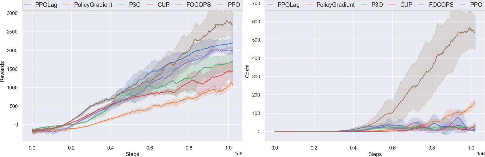
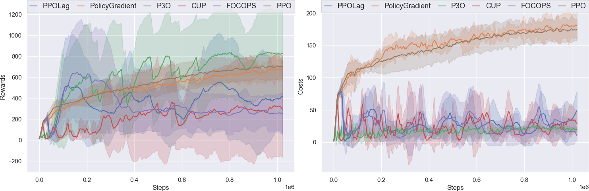
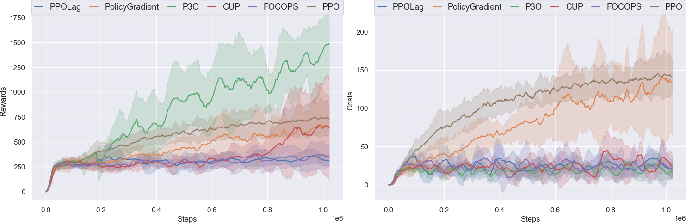
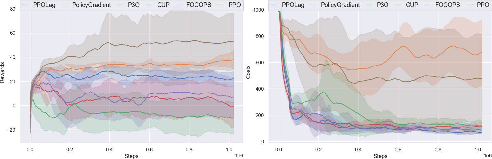

# OmniSafe's Mujoco Velocity Benchmark on Off-Policy Algorithms

OmniSafe's Mujoco Velocity Benchmark evaluated the performance of OmniSafe algorithm implementations in 6 environments from the Safety-Gymnasium task suite For each algorithm and environment supported, we provide:

- Default hyperparameters used for the benchmark and scripts to reproduce the results
- A comparison of performance or code-level details with other open-source implementations or classic papers.
- Graphs and raw data that can be used for research purposes, - Log details obtained during training
- Some hints on how to fine-tune the algorithm for optimal results.

Supported algorithms are listed below:

[Policy Gradient(PG)](https://papers.nips.cc/paper/1999/file/464d828b85b0bed98e80ade0a5c43b0f-Paper.pdf)

[Proximal Policy Optimization (PPO)](https://arxiv.org/pdf/1707.06347.pdf)

[The Lagrange version of PPO (PPO-Lag)](https://cdn.openai.com/safexp-short.pdf)

[Penalized Proximal Policy Optimization for Safe Reinforcement Learning(P3O)]( https://arxiv.org/pdf/2205.11814.pdf)

[First Order Constrained Optimization in Policy Space (FOCOPS)](https://arxiv.org/abs/2002.06506)

 [Constrained Update Projection Approach to Safe Policy Optimization (CUP)](https://arxiv.org/abs/2209.07089) 

## Safety-Gymnasium

We highly recommend using ``safety-gymnasium`` to run the following experiments. To install, in a linux machine, type:

```bash
pip install safety_gymnasium
```

## Run the Benchmark

You can set the main function of ``examples/benchmarks/experimrnt_grid.py`` as:

```python
    eg = ExperimentGrid(exp_name='First_Order_On-Policy-Velocity)
    first_order_on_policy = ['PolicyGradient', 'PPO', 'PPOLag', 'P3O', 'FOCOPS', 'CUP']
    eg.add('algo', first_order_on_policy)
    eg.add('logger_cfgs:use_wandb', [False]) # You can use wandb to monitor the experiment.
    eg.add('logger_cfgs:use_tensorboard', [True]) # You can use tensorboard to monitor the experiment.
    eg.add('env_id', [
        'SafetyHopperVelocity-v4',
        'SafetyWalker2dVelocity-v4',
        'SafetySwimmerVelocity-v4',
        'SafetyAntVelocity-v4',
        'SafetyHalfCheetahVelocity-v4',
        'SafetyHumanoidVelocity-v4'
        ])
    eg.add('seed', [0, 5, 10, 15, 20])
    # total experiment num must can be divided by num_pool
    # meanwhile, users should decide this value according to their machine
    eg.run(train, num_pool=30)
```

After that, you can run the following command to run the benchmark:

```bash
cd examples/benchmarks
python run_experiment_grid.py
```

You can also plot the results by running the following command:

```bash
cd examples
python plot.py --log-dir ALGODIR
```

e.g. ALGODIR can be ``examples/runs/SafetyHopperVelocity-v4``.
Then you can compare different algorithms in ``SafetyHopperVelocity-v4`` environments.

Logs is saved in `examples/benchmarks/runs` and can be monitored with tensorboard or wandb.

```bash
$ tensorboard --logdir examples/benchmarks/runs
```

After the experiment is finished, you can use the following command to generate the video of the trained agent:

```bash
cd examples
python evaluate_saved_policy.py
```

Please note that before you evaluate, please set the ``LOG_DIR`` in ``evaluate_saved_policy.py``.

For example, if I train ``DDPG`` in ``SafetyHumanoidVelocity-v4``

```python
    LOG_DIR = '~/omnisafe/examples/runs/PPO-<SSafetyHumanoidVelocity-v4>/seed-000-2023-03-07-20-25-48'
    play = True
    save_replay = True
    if __name__ == '__main__':
        evaluator = omnisafe.Evaluator(play=play, save_replay=save_replay)
        for item in os.scandir(os.path.join(LOG_DIR, 'torch_save')):
            if item.is_file() and item.name.split('.')[-1] == 'pt':
                evaluator.load_saved(
                    save_dir=LOG_DIR, model_name=item.name, camera_name='track', width=256, height=256
                )
                evaluator.render(num_episodes=1)
                evaluator.evaluate(num_episodes=1)
```

## Example benchmark

<center>
    
    <br>
    <div style="color:orange; border-bottom: 1px solid #d9d9d9;
    display: inline-block;
    color: #999;
    padding: 2px;">SafetyAntVelocity-v4</div>
</center>

<center>
    
    <br>
    <div style="color:orange; border-bottom: 1px solid #d9d9d9;
    display: inline-block;
    color: #999;
    padding: 2px;">SafetyHalfCheetahVelocity-v4</div>
</center>

<center>
    
    <br>
    <div style="color:orange; border-bottom: 1px solid #d9d9d9;
    display: inline-block;
    color: #999;
    padding: 2px;">SafetyHopperVelocity-v4</div>
</center>

<center>
    
    <br>
    <div style="color:orange; border-bottom: 1px solid #d9d9d9;
    display: inline-block;
    color: #999;
    padding: 2px;">SafetyHumanoidVelocity-v4</div>
</center>

<center>
    
    <br>
    <div style="color:orange; border-bottom: 1px solid #d9d9d9;
    display: inline-block;
    color: #999;
    padding: 2px;">SafetyWalker2dVelocity-v4</div>
</center>

<center>
    
    <br>
    <div style="color:orange; border-bottom: 1px solid #d9d9d9;
    display: inline-block;
    color: #999;
    padding: 2px;">SafetySwimmerVelocity-v4</div>
</center>


## Experiment Analysis

### Experiment Results

### PG(1M)

|         Environment          | Reward (OmniSafe) | Cost (Omnisafe) |
| :--------------------------: | :---------------: | :-------------: |
|     SafetyAntVelocity-v4     |   1128.4±654.6    |   155.0±96.5    |
| SafetyHalfCheetahVelocity-v4 |   1700.2±902.4    |   422.2±234.1   |
|   SafetyHopperVelocity-v4    |    674.4±127.2    |   180.5±26.4    |
|  SafetyWalker2dVelocity-v4   |    624.2±301.4    |   125.8±67.5    |
|   SafetySwimmerVelocity-v4   |     37.7±8.2      |   695.0±230.3   |
|  SafetyHumanoidVelocity-v4   |    612.7±131.6    |    38.9±17.8    |

### PPO(1M)

|         Environment          | Reward (OmniSafe) | Cost (Omnisafe) |
| :--------------------------: | :---------------: | :-------------: |
|     SafetyAntVelocity-v4     |   3012.2±1167.0   |   618.3±255.0   |
| SafetyHalfCheetahVelocity-v4 |   3641.1±1202.3   |   812.8±219.1   |
|   SafetyHopperVelocity-v4    |    685.2±132.8    |   170.2±25.7    |
|  SafetyWalker2dVelocity-v4   |    723.0±175.3    |   141.0±30.8    |
|   SafetySwimmerVelocity-v4   |     52.4±19.9     |   472.9±300.3   |
|  SafetyHumanoidVelocity-v4   |    633.3±128.7    |    45.9±16.1    |

### PPOLag(1M)

|         Environment          | Reward (OmniSafe) | Cost (Omnisafe) |
| :--------------------------: | :---------------: | :-------------: |
|     SafetyAntVelocity-v4     |   2256.6±315.1    |    29.8±54.7    |
| SafetyHalfCheetahVelocity-v4 |   2065.5±234.5    |     4.7±5.1     |
|   SafetyHopperVelocity-v4    |    415.8±367.9    |    47.2±28.4    |
|  SafetyWalker2dVelocity-v4   |    310.4±44.7     |    19.9±9.9     |
|   SafetySwimmerVelocity-v4   |     22.0± 7.8     |    63.2±16.3    |
|  SafetyHumanoidVelocity-v4   |    623.0±173.7    |    17.0±19.7    |

### P3O(1M)

|         Environment          | Reward (OmniSafe) | Cost (Omnisafe) |
| :--------------------------: | :---------------: | :-------------: |
|     SafetyAntVelocity-v4     |   1837.5±331.2    |    35.5±28.2    |
| SafetyHalfCheetahVelocity-v4 |   1251.2±117.4    |    14.7±15.3    |
|   SafetyHopperVelocity-v4    |    779.0±383.2    |    21.4±13.9    |
|  SafetyWalker2dVelocity-v4   |   1493.1±515.5    |    27.9±26.7    |
|   SafetySwimmerVelocity-v4   |     -8.8±14.3     |   125.0±58.5    |
|  SafetyHumanoidVelocity-v4   |   1027.3±404.7    |     0.4±2.0     |

### FOCOPS(1M)

|         Environment          | Reward (OmniSafe) | Cost (Omnisafe) |
| :--------------------------: | :---------------: | :-------------: |
|     SafetyAntVelocity-v4     |   2022.0±226.6    |     4.5±5.6     |
| SafetyHalfCheetahVelocity-v4 |   1759.8±414.4    |    31.3±55.2    |
|   SafetyHopperVelocity-v4    |    255.4±190.0    |    10.2±12.4    |
|  SafetyWalker2dVelocity-v4   |    346.3±100.2    |    22.1±16.1    |
|   SafetySwimmerVelocity-v4   |     9.0±17.1      |   86.6 ±80.8    |
|  SafetyHumanoidVelocity-v4   |    703.5±188.0    |    14.4±16.5    |

### CUP(1M)

|         Environment          | Reward (OmniSafe) | Cost (Omnisafe) |
| :--------------------------: | :---------------: | :-------------: |
|     SafetyAntVelocity-v4     |   1530.4±723.3    |    60.6±48.4    |
| SafetyHalfCheetahVelocity-v4 |   1217.6±288.0    |    15.2±14.6    |
|   SafetyHopperVelocity-v4    |    249.8±308.5    |    32.2±21.1    |
|  SafetyWalker2dVelocity-v4   |    673.3±608.6    |    22.2±21.6    |
|   SafetySwimmerVelocity-v4   |     1.2±19.3      |   113.9±57.0    |
|  SafetyHumanoidVelocity-v4   |    535.0±78.2     |    16.3±13.6    |

